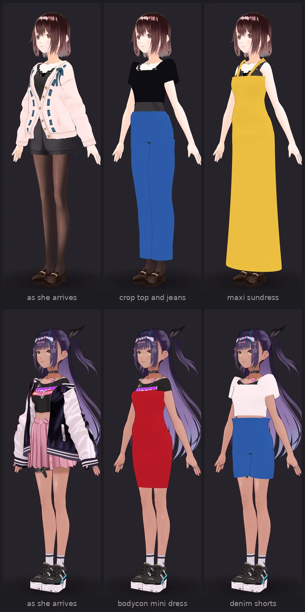
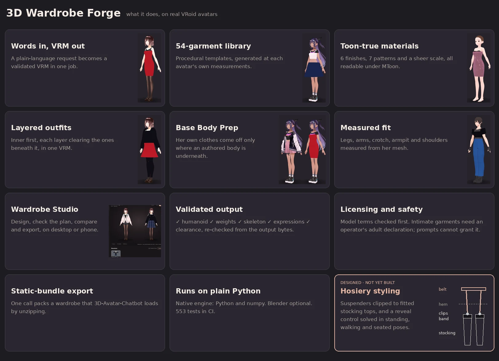

<div align="center">

# 👗 3D Wardrobe Forge

### New outfits for any VRM avatar: designed in seconds, fitted to her body, delivered as a VRM.

Describe a look in plain words. Get the same character wearing it, as a
validated `.vrm` that loads wherever the original did, with a preview, a fit
report and wardrobe metadata. No 3D artist, no Blender required, no garment
assets to license.

[](https://github.com/ruslanmv/3D-Wardrobe-Forge/actions/workflows/ci.yml)


[](LICENSE)

[Why Forge](#why-wardrobe-forge) ·
[See it on real avatars](#built-for-real-avatars) ·
[Features](#what-you-get) ·
[Studio](#wardrobe-studio) ·
[Quick start](#quick-start) ·
[API](#as-a-service) ·
[How it works](#how-it-works) ·
[Docs](#documentation)

</div>

<br />


<p align="center"><sub>Every figure above is an unedited render of a VRM the pipeline produced, on the CC0 avatars in the library.</sub></p>

---

## Why Wardrobe Forge

Avatar apps sell identity, and outfits are the most repeatable part of it. But
every new outfit for a VRM character usually means a 3D artist, a DCC tool, a
rig, weight painting and a round of fixing clipping, per garment and per avatar.

Wardrobe Forge turns that into an API call.

| | |
| --- | --- |
| **Words in, VRM out** | *"black fitted crop top + blue straight jeans"* is a complete request. The planner picks from 54 procedural garments, resolves colour, fabric, cut and layer order, and the pipeline returns the avatar wearing it. |
| **Fitted to her, not to a mannequin** | Every garment is generated at the avatar's own measurements: legs measured every 3 cm, arms along the bone chain, crotch, armpit and shoulder surface measured from her mesh. Nothing is shrinkwrapped onto her, so nothing is stretched out of shape. |
| **Replaces her clothes, cleanly** | VRoid avatars arrive dressed. Forge takes off what the new outfit replaces, after checking there is an authored body under it, and puts the whole outfit on in layers, inner first, as one VRM. |
| **Ships as a standard VRM** | The output is a VRM 0.x or 1.0 file with the original skeleton, humanoid mapping and expressions intact. Any VRM viewer, engine or chatbot that loads the original loads the look. |
| **Checked, not hoped** | Every look is re-imported and validated: humanoid, weights, skeleton, expressions and clearance. The fit report says what passed. |
| **Runs anywhere Python runs** | The native engine is pure Python and numpy. Blender is optional, for AI-generated meshes and a heavier fitting path. |

---

## Built for real avatars

Before and after, on two of the library's VRoid avatars. A's cardigan and
shorts, and B's jacket and skirt, come off. The new outfit goes on, and her
shoes, hair and face stay exactly as they were:



Real avatars are harder than calibration mannequins. Long hair reaches the
thighs, thighs touch, the chest is wider than the shoulder joints, and a shin
bone runs down the front of the leg. The fitter measures each of these instead of
assuming them.
[docs/FIT_QUALITY.md](docs/FIT_QUALITY.md) lists the seven failures real avatars
exposed, and what the fitter does now.

**Proof, not promises.** [`assets/gallery/real/`](assets/gallery/real/README.md)
holds **60 looks: four real avatars × fifteen outfits**, each captioned with the
plan and fit report that produced it. Every job completes and every fit passes.
[`assets/gallery/`](assets/gallery/README.md) holds the 21-look verification
set for materials: lace, mesh, fishnet, sequin, latex and layering.
`tools/gallery` regenerates both from the repository.

---

## What you get



| | |
| --- | --- |
| 🧵 **Garment library** | 54 procedural templates: dresses, tops, skirts, shorts, jeans and trousers, leggings, jumpsuits and catsuits, jackets and coats, swimwear, lingerie, nightwear, legwear and shoes. Adding one is usually a single JSON file. |
| ✨ **Materials that survive a toon shader** | Six finishes (matte, satin, gloss, latex, metallic, sequin) written in the terms MToon has: rim and matcap. Seven patterns (lace, fishnet, sequin, stripes, dots, gingham, plaid) as generated textures, measured in metres of fabric. Sheer fabrics from *slightly sheer* to *very sheer*. |
| ✂️ **Cut as parameters** | Coverage from full to micro, V, plunge and sweetheart necklines, low backs, high-cut legs, rise, and strap networks (shoulder, halter, string ties, cross-back, garter, harness), each honoured by the geometry. |
| 🧥 **Layered outfits** | `bralette + briefs + stockings + sheer dress + cropped jacket` is built in one job, in order, with each layer clearing the ones inside it. |
| 🔍 **Base Body Prep** | Garment inventory, a strip plan for the whole outfit, and a body-integrity check before anything comes off. It never outputs an undressed avatar and never generates anatomy. |
| 📐 **Measured fit** | Hair and head never count as body. Legs, arms, crotch, armpit and shoulders are measured. Clearance is checked at vertices and across faces. |
| ✅ **Validation** | File, humanoid mapping, weights, skeleton, expressions, severe intersections, recoverability and preview, all re-checked from the output bytes. |
| 📦 **Export** | One call packs an avatar's whole wardrobe as a static bundle. [3D-Avatar-Chatbot](https://github.com/ruslanmv/3D-Avatar-Chatbot) and yourfriend.online load it by unzipping it. |
| 🛡️ **Licensing and safety** | The avatar's usage terms are enforced before any geometry work. Swimwear, lingerie and anything see-through require both the model's terms and an operator's declaration that the avatar depicts an adult. A prompt can never supply that declaration. |

Details: [docs/STYLING.md](docs/STYLING.md) for materials, cuts and layers;
[docs/FIT_QUALITY.md](docs/FIT_QUALITY.md) for how garments meet a real body.

**Designed next: hosiery and suspender styling.** Suspender belts, waspies and
guêpières whose straps clip onto the fitted stocking tops, with strap tension
checked in walking and seated poses. Seamed and lace-top stockings. A **reveal**
control that sets a skirt's hem against the stockings: hidden, a glimpse when she
sits, or on show. It is additive and behind the existing adult gate, and nothing it
adds changes a look made today. The complete plan is in
[docs/HOSIERY_UPGRADE.md](docs/HOSIERY_UPGRADE.md), with the garments in
[HOSIERY_STYLING](docs/HOSIERY_STYLING.md) and the assets and rendering in
[HOSIERY_PREVIEW](docs/HOSIERY_PREVIEW.md). None of it is built yet.

---

## Wardrobe Studio


The Studio is Forge's editor, served by the same process at `/studio/`. You work
on the **five CC0 avatars that
[yourfriend.online](https://github.com/ruslanmv/yourfriend) ships**, in a Three.js
viewport pinned to the renderer versions that site uses. A look that renders
here renders there.

| | |
| --- | --- |
| **Design** | Category, template, silhouette, length and colour controls built from `/v1/vocabulary`, so the editor cannot offer a value the planner would ignore. |
| **Style** | Finish, pattern, see-through level, coverage, straps and neckline. Each is an override the planner honours, and each is gated before the server would refuse it. |
| **Layer** | Write an outfit with `+` and it is built inner first. **Check plan** reports, before anything runs, which layers will be built, what of her own outfit comes off, whether there is a body under it, and whether each garment passes the gate. |
| **Judge** | The same body in two outfits under the same light, side by side, on a turntable, with the fit report beside it. |
| **Export** | One click packs the wardrobe as a static bundle for [3D-Avatar-Chatbot](https://github.com/ruslanmv/3D-Avatar-Chatbot) or yourfriend.online. |

<p align="center">
  
</p>

It works on a phone as well as a desktop.

```bash
make install
make studio        # fetches and verifies the avatar library, then serves
                   # → http://127.0.0.1:8080/studio/
```

**The avatars are proven, not trusted.** `assets/library/models.json` pins each
file by size and SHA-256. It is yourfriend's provenance manifest, with one
correction: the `presentation` of AvatarSample B and C was swapped there, and
their material prefixes (`F00_`, `M00_`) say which is which.
`tools/fetch_library.py` discards anything that does not match its hash. An
avatar whose bytes have drifted is listed as unavailable with the reason, and is
never served.

**Library avatars need no licence prompt, and the browser cannot supply one.**
The Studio posts to `POST /v1/library/{slug}/jobs`, where the *server* fills in
the avatar and the terms its provenance manifest grants (CC0 → modification and
redistribution allowed). An embedded prohibition is still checked first and still
wins.

---

## Quick start

```bash
pip install -e ".[dev,preview]"

# Generate four calibration avatars to play with
wardrobe-forge fixtures --out assets/fixtures

wardrobe-forge create \
  --avatar assets/fixtures/calibration-b-medium-vrm1.vrm \
  --prompt "elegant dark red evening dress"
```

```text
job job_…: completed
  plan: Red Evening  [dress/sheath/floor]  template=dress-evening-column-v1
  fit report (engine=native):
    PASS  vrm valid
    PASS  humanoid valid
    PASS  weights valid
    PASS  skeleton preserved
    PASS  expressions preserved
    PASS  source recoverable
    PASS  preview rendered
    ----  clipping: passed

dist/yourfriend-online/
├── wardrobe.json
├── avatars.json
├── catalog.json
├── provenance.json
└── looks/
    └── calibration-b-medium-vrm1/
        └── look-…/
            ├── look.vrm
            ├── preview.webp
            ├── look.json
            └── fit-report.json
```

That runs with **no Blender, no API keys and no third-party assets**. The legacy
flat output remains available with `--target generic`; see
[docs/YOURFRIEND_ASSET_BUNDLE.md](docs/YOURFRIEND_ASSET_BUNDLE.md).

---

## As a service

```bash
cp .env.example .env
docker compose up --build
```

```bash
# Upload once, then generate as many looks as you like
KEY=$(curl -s -F file=@mira.vrm http://localhost:8080/v1/avatars | jq -r .storageKey)

curl -s -X POST http://localhost:8080/v1/jobs \
  -H 'content-type: application/json' \
  -d "{\"avatar\":{\"storageKey\":\"$KEY\",\"avatarId\":\"mira\"},
       \"outfit\":{\"prompt\":\"black satin cocktail dress\"}}"
```

Poll `GET /v1/jobs/{id}` or subscribe to `GET /v1/jobs/{id}/events`. Product
integrations can use the smaller `POST /v1/generate` facade, which delegates to
the same pipeline.

| Endpoint | Purpose |
| --- | --- |
| `POST /v1/avatars` · `POST /v1/avatars/inspect` | upload a VRM / check whether it is usable and modifiable |
| `POST /v1/jobs` · `POST /v1/generate` | request a look |
| `GET /v1/jobs/{id}` · `…/events` | poll or stream progress |
| `GET /v1/wardrobes/{avatar}` | every look an avatar has |
| `GET /v1/wardrobes/{avatar}/bundle.zip` | **the whole wardrobe as a static bundle** (`?passedOnly=true` drops failed fits) |
| `GET /v1/library` · `POST /v1/library/{slug}/jobs` | the Studio's avatar library, and jobs on it |
| `GET /v1/vocabulary` | the colours, cuts and lengths the planner understands |
| `GET /v1/templates` · `GET /v1/capabilities` | the garment library · what this deployment can do |

Full reference: [docs/API.md](docs/API.md).

---

## How it works

```text
             ┌─────────────────────────┐
             │    source-avatar.vrm    │
             └────────────┬────────────┘
                          ▼
                 Analyze humanoid
                 body + skeleton
                          │
User prompt ─────► Outfit Planner
"elegant dark red         ├──────── Template path (production)
 evening dress"           └──────── AI-generated path (experimental)
                          ▼
                    Garment mesh
                          ▼
                 Automatic fitting
                    ┌─────┴─────┐
                 Skinning    Body mask
                    └─────┬─────┘
                          ▼
                    VRM assembly
                          ▼
                     Validation
             ┌─────────────────────────┐
             │ avatar-new-look.vrm     │
             │ preview.webp            │
             │ wardrobe.json           │
             │ fit-report.json         │
             └─────────────────────────┘
```

The calling application never learns about Blender, Meshy, Tripo, fitting, skin
weights or clipping — it asks for a look and receives a `.vrm` it already knows
how to load.

A VRM is a GLB container, so most of the job needs no 3D application:
`wardrobe/vrm/` parses, validates, measures, skins and reassembles VRM files in
pure Python. That is why the entire acceptance suite runs in CI on every commit.

Garments are **generated at each avatar's own measurements** rather than deformed
onto them. A template declares parameters — coverage, anchors, clearance,
silhouette, hem — and the shell is built to fit, so fitting cannot fail the way a
shrinkwrap can.

Two engines implement the same interface and share the same shell:

| | `native` | `blender` |
| --- | --- | --- |
| Needs | Python only | Blender + VRM add-on |
| Skin weights | analytic binding to humanoid bones | transferred from the body mesh |
| Clipping | radial push-out, guaranteed outside the body | BVH test and repair |
| Replacing clothes | removes the avatar's own clothing primitives (Base Body Prep) | the same, plus masking of covered body polygons |
| Layered outfits | ✓ inner first, one VRM | one garment per job (layered outfits use native) |
| AI-generated meshes | ✗ | ✓ cleanup and retopology |
| Preview | software rasteriser | EEVEE render |

`WARDROBE_ENGINE=auto` uses Blender when it is installed and native otherwise.

> **Replacing, not just layering.** VRoid exports keep each clothing slot as its
> own primitive over a complete body, so the native engine can take her top off
> before a new one goes on — after checking there is a body under it. A model
> whose clothing it cannot recognise is layered over, never guessed at.

### The bar for "it works"

Not "the exporter exited 0". The produced bytes are re-imported from scratch and
checked:

```text
✓ file parses                    ✓ garment has valid weights
✓ humanoid mapping preserved     ✓ animation poses work
✓ head/face still work           ✓ severe body intersections absent
✓ skeleton preserved             ✓ original avatar remains recoverable
✓ expressions preserved          ✓ preview renders
```

`tests/e2e/test_acceptance.py` asserts all of it across **7 garments × 4 body
types × 2 VRM specs**. The four calibration bodies span 1.48 m to 1.83 m with hip
widths varying by more than 1.5×, and a test enforces that they stay different.

### Licensing is a pipeline stage

A VRM carries usage terms, and deriving a new model is exactly what they govern.
The check runs **before** any geometry work:

- terms prohibit modification → `451`, `source_model_modification_not_permitted`
- terms unknown → `428`, `requires_user_license_attestation`
- the caller's attestation can *supply* missing terms, never override a prohibition

VRoid Hub conditions-of-use objects are accepted verbatim, in the shape the
chatbot's VRM Manager already stores. See [docs/LICENSING.md](docs/LICENSING.md).

### Garment library

54 templates across dresses, tops, skirts, shorts, trousers and leggings, jumpsuits,
jackets, swimwear, underwear, nightwear, legwear and shoes, every one procedural —
the shell is generated at each avatar's measurements, so the repository needs no
binary garment assets. Adding a garment is usually a single
JSON file; see [docs/GARMENT_TEMPLATE_SPEC.md](docs/GARMENT_TEMPLATE_SPEC.md).

```bash
wardrobe-forge templates          # list and validate the library
wardrobe-forge inspect --avatar mira.vrm
```

---

## Try-On Haul, on the client

```js
const forge = new WardrobeClient({ baseUrl: WARDROBE_FORGE_URL });
const wardrobe = new WardrobeController({ forge, viewer: window.NEXUS_VIEWER });

await wardrobe.tryOnHaul([
    'elegant burgundy evening dress',
    'cozy oversized wool coat',
    'slim blue denim jeans',
], { holdMs: 5000 });
// returns to the original avatar at the end
```

`clients/javascript/` drives 3D-Avatar-Chatbot's existing `AvatarManager` through
its public API — the viewer needs no changes. See
[docs/3D_AVATAR_CHATBOT_INTEGRATION.md](docs/3D_AVATAR_CHATBOT_INTEGRATION.md).

---

## Deploy to Hugging Face

The root `Dockerfile` is the Space image: the API, the Studio at `/`, and the
avatar library fetched and verified at build time.

1. Create a **Docker** Space and use
   [`deploy/huggingface/SPACE_README.md`](deploy/huggingface/SPACE_README.md) as
   its `README.md`.
2. Push this repository to it (`HF_SPACE_REPO=user/space sh deploy/huggingface/deploy.sh`).
3. Set the variables from
   [`deploy/huggingface/env.example`](deploy/huggingface/env.example).

The image runs as **uid 1000**, which is what Spaces use, and storage on a free
Space is ephemeral — export what you want to keep. Profiles, authentication and
production storage are in [deploy/huggingface/README.md](deploy/huggingface/README.md).

---

## Development

```bash
make install        # editable install with dev extras
make library        # fetch + verify the avatar library (FROM=../yourfriend/public/avatar/models/cc0 to copy)
make studio         # the API and the Studio, with reload, on :8080
make test           # the whole suite
make test-e2e       # the acceptance matrix
make test-blender   # skipped unless Blender is installed
make lint
```

### Status

M0–M4, M6 and M7 are done; M5 (AI-generated meshes) has adapters and Blender-side
cleanup written but is unverified against the live provider APIs. The state of
every milestone, the design decisions behind it, and the bugs the acceptance
matrix caught are in [docs/IMPLEMENTATION_PLAN.md](docs/IMPLEMENTATION_PLAN.md).

---

## Known limitations

Stated plainly, because the gallery shows them:

- **Clothing painted onto an avatar's skin texture stays.** Only garment meshes
  can be taken off, so a low-cut outfit shows whatever the texture paints under
  it.
- **Jackets and coats are boxy at the shoulder.** Their sleeves are measured
  from the arm; their shoulders are not yet.
- **Legs that touch give trousers that touch.** The two legs are separate
  meshes, but no gap shows between them from the front.
- **One pose.** Garments are fitted in the rest pose and skinned. The pose
  stress test checks that they follow the body; the pictures show the A-pose.
- **Layered outfits use the native engine.** Blender dresses one garment per job.
- **AI-generated meshes (M5) are unverified** against the live provider APIs.

---

## Documentation

| | |
| --- | --- |
| [STYLING](docs/STYLING.md) | materials, cuts, straps, Base Body Prep and layered outfits, the adult gate |
| [FIT_QUALITY](docs/FIT_QUALITY.md) | fitting a real avatar: what broke on the library avatars, and what the fitter does now |
| [HOSIERY_UPGRADE](docs/HOSIERY_UPGRADE.md) | *design, not built*: the complete hosiery plan, the `garter_belt.py` analysis, the renderer contract |
| [HOSIERY_STYLING](docs/HOSIERY_STYLING.md) | *design, not built*: suspender belts, stockings and the reveal control |
| [HOSIERY_PREVIEW](docs/HOSIERY_PREVIEW.md) | *design, not built*: flat straps, clip hardware, denier falloff and the web preview backend |
| [ARCHITECTURE](docs/ARCHITECTURE.md) | components, layers, extension points |
| [PIPELINE](docs/PIPELINE.md) | the ten stages and the failure model |
| [API](docs/API.md) | HTTP reference |
| [GARMENT_TEMPLATE_SPEC](docs/GARMENT_TEMPLATE_SPEC.md) | template schema, `coverage` vs `anchors` |
| [WARDROBE_SPEC](docs/WARDROBE_SPEC.md) | manifest format |
| [BLENDER_FITTING](docs/BLENDER_FITTING.md) | the Blender worker |
| [VRM_COMPATIBILITY](docs/VRM_COMPATIBILITY.md) | what is accepted, what is rejected, limitations |
| [SECURITY](docs/SECURITY.md) | threat model and privacy |
| [LICENSING](docs/LICENSING.md) | usage terms as a pipeline stage |
| [3D_AVATAR_CHATBOT_INTEGRATION](docs/3D_AVATAR_CHATBOT_INTEGRATION.md) | client integration |
| [IMPLEMENTATION_PLAN](docs/IMPLEMENTATION_PLAN.md) | milestones and next steps |
| [YOURFRIEND_ASSET_BUNDLE](docs/YOURFRIEND_ASSET_BUNDLE.md) | static product bundle contract |
| [HUGGING FACE](deploy/huggingface/README.md) | Docker Space, the Studio, and production profiles |

## License

MIT — see [LICENSE](LICENSE). The avatar library is CC0, with its provenance kept
beside it in [`assets/library/models.json`](assets/library/models.json).
