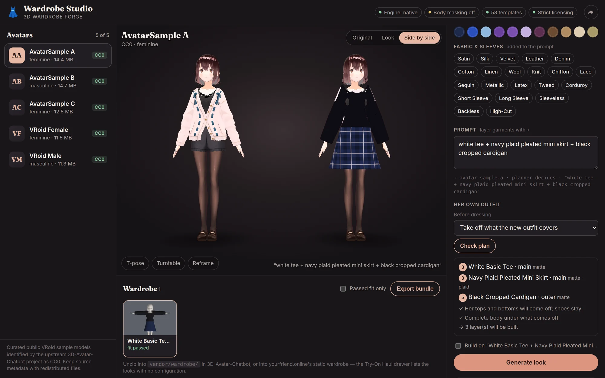
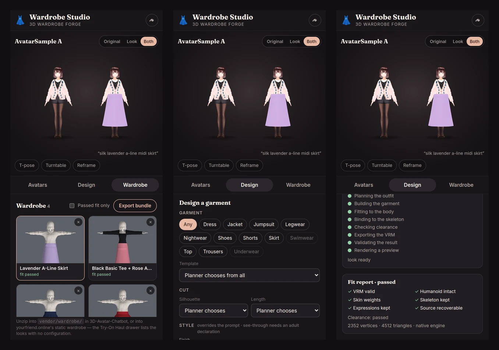

<div align="center">

# 👗 3D Wardrobe Forge

**Outfit generation for VRM avatars — with a studio to design, judge and ship them.**

Give it a VRM and an outfit request. Get the same character wearing the new outfit
as a validated VRM, with a preview, a fit report and wardrobe metadata.

[](https://github.com/ruslanmv/3D-Wardrobe-Forge/actions/workflows/ci.yml)


[](LICENSE)

[Wardrobe Studio](#wardrobe-studio) ·
[Styling & layers](#styling-and-layered-outfits) ·
[Quick start](#quick-start) ·
[API](#as-a-service) ·
[How it works](#how-it-works) ·
[Deploy](#deploy-to-hugging-face) ·
[Docs](#documentation)

</div>

<br />



---

## Wardrobe Studio

The Studio is the Forge's editor, served by the same process at `/studio/`. Open it
and you are working on the **five CC0 avatars that
[yourfriend.online](https://github.com/ruslanmv/yourfriend) ships**, in a Three.js
viewport pinned to the same renderer versions that site uses — so a look that
renders here renders there.

| | |
| --- | --- |
| **Design** | Category, template, silhouette, length and colour controls built from `/v1/vocabulary` — the editor cannot offer a value the planner would ignore. Fabric and sleeve chips edit the prompt in plain sight, because that is the only place the planner reads them. |
| **Style** | Finish (matte, satin, gloss, latex, metallic, sequin), pattern (lace, fishnet, stripes, dots, gingham, plaid), see-through level, coverage (full → micro), straps and neckline — each an override the planner honours, and each gated before the server would refuse it. |
| **Layer** | Write an outfit with `+` — *white tee + plaid pleated mini skirt + black cropped cardigan* — and it is built inner first, in one job, as one VRM. **Check plan** says, before anything runs, which layers will be built, what of her own outfit comes off, whether there is a body under it, and whether the adult gate lets each garment through. **Build on the look on stage** adds a garment to a look she already has. |
| **Generate** | Jobs run through the real pipeline and the progress list is its state machine — queued, measuring, planning, fitting, binding, clearance, export, validation, preview — not a timer. |
| **Judge** | The same body in two outfits under the same light, side by side. Toggle the rest pose to see clearance under the arms, spin it on a turntable, and read the fit report beside it. |
| **Export** | One click packs the avatar's wardrobe as a static bundle. Unzip it into [3D-Avatar-Chatbot](https://github.com/ruslanmv/3D-Avatar-Chatbot)'s `vendor/wardrobe/` or yourfriend.online's wardrobe and the Try-On Haul drawer lists every look — no configuration. |

<p align="center">
  
</p>

It works on a phone as well as a desktop: the viewport stays on top and the
library, designer and wardrobe become tabs.

```bash
make install
make studio        # fetches and verifies the avatar library, then serves
                   # → http://127.0.0.1:8080/studio/
```

**The avatars are proven, not trusted.** `assets/library/models.json` is a verbatim
copy of yourfriend's provenance manifest, pinning each file by size and SHA-256.
`tools/fetch_library.py` downloads them (from yourfriend first, the upstream source
second) and discards anything that does not match. An avatar whose bytes have
drifted is listed as unavailable with the reason — never served.

**Library avatars need no licence prompt, and the browser cannot supply one.**
All five embed `modification: unknown`, so under strict licensing a plain job on
them is refused. The Studio posts to `POST /v1/library/{slug}/jobs`, where the
*server* fills in the avatar and the terms its provenance manifest grants (CC0 →
modification and redistribution allowed). An embedded prohibition is still
checked first and still wins.

---

## Styling and layered outfits

### Materials that survive a toon shader

The avatars this project dresses are cel-shaded MToon, and a garment borrows the
avatar's own MToon so it shades like her clothes. MToon has no roughness and no
metalness, so "latex" used to render as flat colour. A finish is now written in
the terms a toon shader *has*: a parametric rim and an additive **matcap**
(crisp-edged, the anime convention for latex and gloss), with deeper shade for
shine to read against. See-through fabric is alpha blending; lace and fishnet are
alpha-masked holes; stripes, dots, gingham and plaid are colour baked into a
tiling texture. Textures are **generated** — numpy and a 60-line PNG writer, no
image assets, byte-identical every run — and UVs are metres of fabric, so a
fishnet diamond is 1.4 cm on a stocking or a bodysuit, on any avatar, with the
seam at her back. Both engines are handed the same resolved material.

### Cut, coverage and straps as parameters

"Micro" is a coverage, not a category: a micro bikini is a bikini at 0.58. Edges
need not be horizontal — V, plunge and sweetheart necklines, low backs, high-cut
and thong leg lines, triangle cups on a string band — and straps are networks:
halter, string ties, cross-back, garter belt with suspenders, harness. New shapes:
catsuit and leggings, fitted round each leg's own bones.

### Base Body Prep: undress once, dress in layers

A VRoid avatar arrives dressed. One job now takes off what the new outfit
replaces and puts the whole outfit on, inner first:

```text
garment inventory ─► strip plan for the whole outfit ─► is there a body under it?
   (Forge tag > Forge marker > VRoid name;          no → keep it on, or refuse the job
    anything unrecognised is never removed)               — nothing is generated in its place
        ─► measure once ─► foundation ─► legwear ─► main ─► one-piece ─► outer ─► one VRM
```

- **The whole outfit decides.** A bra alone never takes off a one-piece dress; a
  bra, briefs and a dress together do.
- **Layers stay layers.** Each fitted layer joins what the next must clear, so the
  dress goes over the underwear, and the underwear is still there — visible under
  a sheer dress. Forge garments are tagged, so a later outer layer leaves them on.
- **Modes:** `preserve` layers over her outfit, `replace-outer` (default) takes
  off what the outfit covers, `underwear-base` also puts a neutral foundation on
  first. **No mode outputs her with nothing on**, the stripped state is never
  stored, and the stored source is byte-identical after every job.
- **Provenance:** the look records the base-body mode, which of her garments came
  off and the layers put on; the fit report has an entry — and a design sheet —
  per layer.

### What is gated, and by whom

Swimwear, underwear and **anything the body shows through** — a sheer dress,
unlined lace, fishnet — need both the model's own terms to allow it and an
operator's declaration that the avatar depicts an adult. The gate follows what
will render, not the category name: an opaque bodycon dress is a dress; the same
dress sheer is gated. The declaration lives in `assets/library/policy.json`,
shipped empty — it is the operator's decision, recorded by them, never the
browser's. The engine models garments on the authored body; it never adds or
reconstructs anatomy.

---

## Quick start

```bash
pip install -e ".[dev,preview]"

# Generate four calibration avatars to play with
wardrobe-forge fixtures --out assets/fixtures

wardrobe-forge create \
  --avatar assets/fixtures/calibration-b-medium-vrm1.vrm \
  --prompt "elegant dark red evening dress"
```

```text
job job_…: completed
  plan: Red Evening  [dress/sheath/floor]  template=dress-evening-column-v1
  fit report (engine=native):
    PASS  vrm valid
    PASS  humanoid valid
    PASS  weights valid
    PASS  skeleton preserved
    PASS  expressions preserved
    PASS  source recoverable
    PASS  preview rendered
    ----  clipping: passed

dist/yourfriend-online/
├── wardrobe.json
├── avatars.json
├── catalog.json
├── provenance.json
└── looks/
    └── calibration-b-medium-vrm1/
        └── look-…/
            ├── look.vrm
            ├── preview.webp
            ├── look.json
            └── fit-report.json
```

That runs with **no Blender, no API keys and no third-party assets**. The legacy
flat output remains available with `--target generic`; see
[docs/YOURFRIEND_ASSET_BUNDLE.md](docs/YOURFRIEND_ASSET_BUNDLE.md).

---

## As a service

```bash
cp .env.example .env
docker compose up --build
```

```bash
# Upload once, then generate as many looks as you like
KEY=$(curl -s -F file=@mira.vrm http://localhost:8080/v1/avatars | jq -r .storageKey)

curl -s -X POST http://localhost:8080/v1/jobs \
  -H 'content-type: application/json' \
  -d "{\"avatar\":{\"storageKey\":\"$KEY\",\"avatarId\":\"mira\"},
       \"outfit\":{\"prompt\":\"black satin cocktail dress\"}}"
```

Poll `GET /v1/jobs/{id}` or subscribe to `GET /v1/jobs/{id}/events`. Product
integrations can use the smaller `POST /v1/generate` facade, which delegates to
the same pipeline.

| Endpoint | Purpose |
| --- | --- |
| `POST /v1/avatars` · `POST /v1/avatars/inspect` | upload a VRM / check whether it is usable and modifiable |
| `POST /v1/jobs` · `POST /v1/generate` | request a look |
| `GET /v1/jobs/{id}` · `…/events` | poll or stream progress |
| `GET /v1/wardrobes/{avatar}` | every look an avatar has |
| `GET /v1/wardrobes/{avatar}/bundle.zip` | **the whole wardrobe as a static bundle** (`?passedOnly=true` drops failed fits) |
| `GET /v1/library` · `POST /v1/library/{slug}/jobs` | the Studio's avatar library, and jobs on it |
| `GET /v1/vocabulary` | the colours, cuts and lengths the planner understands |
| `GET /v1/templates` · `GET /v1/capabilities` | the garment library · what this deployment can do |

Full reference: [docs/API.md](docs/API.md).

---

## How it works

```text
             ┌─────────────────────────┐
             │    source-avatar.vrm    │
             └────────────┬────────────┘
                          ▼
                 Analyze humanoid
                 body + skeleton
                          │
User prompt ─────► Outfit Planner
"elegant dark red         ├──────── Template path (production)
 evening dress"           └──────── AI-generated path (experimental)
                          ▼
                    Garment mesh
                          ▼
                 Automatic fitting
                    ┌─────┴─────┐
                 Skinning    Body mask
                    └─────┬─────┘
                          ▼
                    VRM assembly
                          ▼
                     Validation
             ┌─────────────────────────┐
             │ avatar-new-look.vrm     │
             │ preview.webp            │
             │ wardrobe.json           │
             │ fit-report.json         │
             └─────────────────────────┘
```

The calling application never learns about Blender, Meshy, Tripo, fitting, skin
weights or clipping — it asks for a look and receives a `.vrm` it already knows
how to load.

A VRM is a GLB container, so most of the job needs no 3D application:
`wardrobe/vrm/` parses, validates, measures, skins and reassembles VRM files in
pure Python. That is why the entire acceptance suite runs in CI on every commit.

Garments are **generated at each avatar's own measurements** rather than deformed
onto them. A template declares parameters — coverage, anchors, clearance,
silhouette, hem — and the shell is built to fit, so fitting cannot fail the way a
shrinkwrap can.

Two engines implement the same interface and share the same shell:

| | `native` | `blender` |
| --- | --- | --- |
| Needs | Python only | Blender + VRM add-on |
| Skin weights | analytic binding to humanoid bones | transferred from the body mesh |
| Clipping | radial push-out, guaranteed outside the body | BVH test and repair |
| Replacing clothes | removes the avatar's own clothing primitives (Base Body Prep) | the same, plus masking of covered body polygons |
| Layered outfits | ✓ inner first, one VRM | one garment per job (layered outfits use native) |
| AI-generated meshes | ✗ | ✓ cleanup and retopology |
| Preview | software rasteriser | EEVEE render |

`WARDROBE_ENGINE=auto` uses Blender when it is installed and native otherwise.

> **Replacing, not just layering.** VRoid exports keep each clothing slot as its
> own primitive over a complete body, so the native engine can take her top off
> before a new one goes on — after checking there is a body under it. A model
> whose clothing it cannot recognise is layered over, never guessed at.

### The bar for "it works"

Not "the exporter exited 0". The produced bytes are re-imported from scratch and
checked:

```text
✓ file parses                    ✓ garment has valid weights
✓ humanoid mapping preserved     ✓ animation poses work
✓ head/face still work           ✓ severe body intersections absent
✓ skeleton preserved             ✓ original avatar remains recoverable
✓ expressions preserved          ✓ preview renders
```

`tests/e2e/test_acceptance.py` asserts all of it across **7 garments × 4 body
types × 2 VRM specs**. The four calibration bodies span 1.48 m to 1.83 m with hip
widths varying by more than 1.5×, and a test enforces that they stay different.

### Licensing is a pipeline stage

A VRM carries usage terms, and deriving a new model is exactly what they govern.
The check runs **before** any geometry work:

- terms prohibit modification → `451`, `source_model_modification_not_permitted`
- terms unknown → `428`, `requires_user_license_attestation`
- the caller's attestation can *supply* missing terms, never override a prohibition

VRoid Hub conditions-of-use objects are accepted verbatim, in the shape the
chatbot's VRM Manager already stores. See [docs/LICENSING.md](docs/LICENSING.md).

### Garment library

53 templates across dresses, tops, skirts, shorts, trousers and leggings, jumpsuits,
jackets, swimwear, underwear, nightwear, legwear and shoes, every one procedural —
the shell is generated at each avatar's measurements, so the repository needs no
binary garment assets. Adding a garment is usually a single
JSON file; see [docs/GARMENT_TEMPLATE_SPEC.md](docs/GARMENT_TEMPLATE_SPEC.md).

```bash
wardrobe-forge templates          # list and validate the library
wardrobe-forge inspect --avatar mira.vrm
```

---

## Try-On Haul, on the client

```js
const forge = new WardrobeClient({ baseUrl: WARDROBE_FORGE_URL });
const wardrobe = new WardrobeController({ forge, viewer: window.NEXUS_VIEWER });

await wardrobe.tryOnHaul([
    'elegant burgundy evening dress',
    'cozy oversized wool coat',
    'slim blue denim jeans',
], { holdMs: 5000 });
// returns to the original avatar at the end
```

`clients/javascript/` drives 3D-Avatar-Chatbot's existing `AvatarManager` through
its public API — the viewer needs no changes. See
[docs/3D_AVATAR_CHATBOT_INTEGRATION.md](docs/3D_AVATAR_CHATBOT_INTEGRATION.md).

---

## Deploy to Hugging Face

The root `Dockerfile` is the Space image: the API, the Studio at `/`, and the
avatar library fetched and verified at build time.

1. Create a **Docker** Space and use
   [`deploy/huggingface/SPACE_README.md`](deploy/huggingface/SPACE_README.md) as
   its `README.md`.
2. Push this repository to it (`HF_SPACE_REPO=user/space sh deploy/huggingface/deploy.sh`).
3. Set the variables from
   [`deploy/huggingface/env.example`](deploy/huggingface/env.example).

The image runs as **uid 1000**, which is what Spaces use, and storage on a free
Space is ephemeral — export what you want to keep. Profiles, authentication and
production storage are in [deploy/huggingface/README.md](deploy/huggingface/README.md).

---

## Development

```bash
make install        # editable install with dev extras
make library        # fetch + verify the avatar library (FROM=../yourfriend/public/avatar/models/cc0 to copy)
make studio         # the API and the Studio, with reload, on :8080
make test           # the whole suite
make test-e2e       # the acceptance matrix
make test-blender   # skipped unless Blender is installed
make lint
```

### Status

M0–M4, M6 and M7 are done; M5 (AI-generated meshes) has adapters and Blender-side
cleanup written but is unverified against the live provider APIs. The state of
every milestone, the design decisions behind it, and the bugs the acceptance
matrix caught are in [docs/IMPLEMENTATION_PLAN.md](docs/IMPLEMENTATION_PLAN.md).

---

## Documentation

| | |
| --- | --- |
| [ARCHITECTURE](docs/ARCHITECTURE.md) | components, layers, extension points |
| [PIPELINE](docs/PIPELINE.md) | the ten stages and the failure model |
| [API](docs/API.md) | HTTP reference |
| [GARMENT_TEMPLATE_SPEC](docs/GARMENT_TEMPLATE_SPEC.md) | template schema, `coverage` vs `anchors` |
| [WARDROBE_SPEC](docs/WARDROBE_SPEC.md) | manifest format |
| [BLENDER_FITTING](docs/BLENDER_FITTING.md) | the Blender worker |
| [VRM_COMPATIBILITY](docs/VRM_COMPATIBILITY.md) | what is accepted, what is rejected, limitations |
| [SECURITY](docs/SECURITY.md) | threat model and privacy |
| [LICENSING](docs/LICENSING.md) | usage terms as a pipeline stage |
| [3D_AVATAR_CHATBOT_INTEGRATION](docs/3D_AVATAR_CHATBOT_INTEGRATION.md) | client integration |
| [IMPLEMENTATION_PLAN](docs/IMPLEMENTATION_PLAN.md) | milestones and next steps |
| [YOURFRIEND_ASSET_BUNDLE](docs/YOURFRIEND_ASSET_BUNDLE.md) | static product bundle contract |
| [HUGGING FACE](deploy/huggingface/README.md) | Docker Space, the Studio, and production profiles |

## License

MIT — see [LICENSE](LICENSE). The avatar library is CC0, with its provenance kept
beside it in [`assets/library/models.json`](assets/library/models.json).
