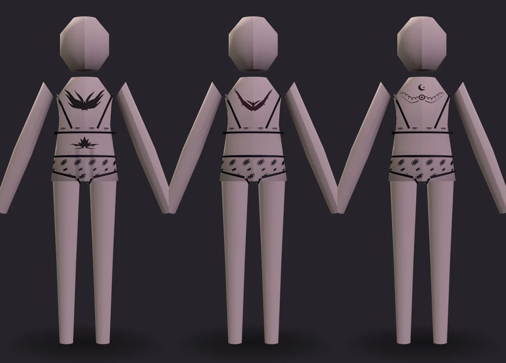
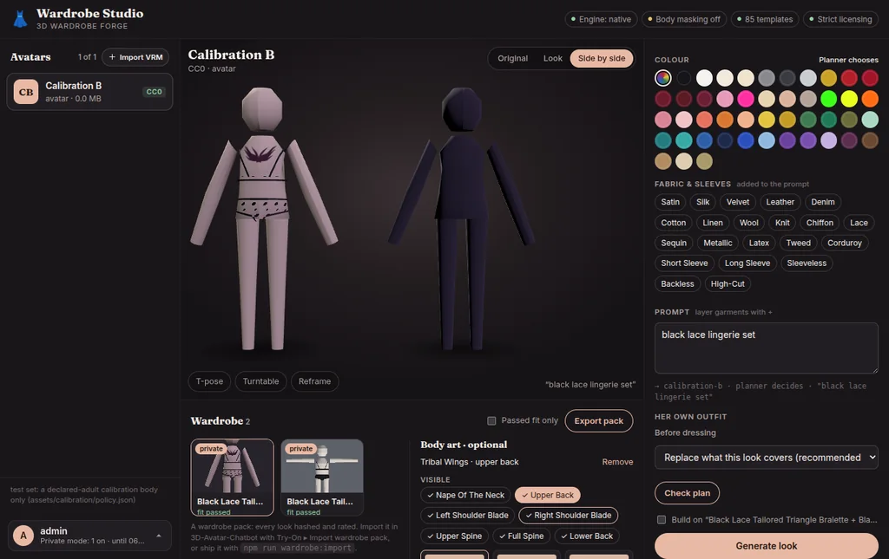

# Body art (tattoos) plan

> Status: **BA1–BA7 implemented** on `claude/body-art-tattoos` (request fields
> and catalogue; exposure on the finished outfit; projection; the two stages;
> ten designs, raster install and the back-view preview; tattoo-only jobs and
> the lifecycle; the Studio section). BA8–BA10 are still a plan. Three things were built differently from what is
> written below, each for a measured reason — see "As built" at the end.
> Batches are `BA1`–`BA10`; commit subjects and code comments carry the prefix
> (`BA3: …`). Every file, function and number below was read or measured in
> this repository at `a0760eb`, the five library avatars included. Revised
> after the owner's decision that **clothes always come first** (§0); where
> this plan departs from the design brief it answers, section 2 says so and
> why.

Tattoos are **body-art decals**: a thin skinned patch just above her skin with
a transparent ink texture. They are an **accessory to exposed skin**, never a
layer that competes with clothing:

```
AVATAR
   ↓
CLOTHES          mandatory, highest visual priority: planned, replaced, built, fitted
   ↓
EXPOSED SKIN     measured on the finished outfit
   ↓
OPTIONAL TATTOO  only where the clothes leave skin visible
```

Nothing is painted into the avatar's own skin texture. A tattoo already painted
into a source avatar's skin is hers: it is left exactly as it is, and her
clothes cover it or not as they always did. This feature is only about tattoos
Forge adds to a derived look.

## 0. The rules this plan is built around

| # | Invariant | How it is enforced |
|---|---|---|
| I1 | A job without `bodyArt` produces **the same bytes and the same fit report** it does today. | Neither new stage does anything, not even parse, when the job has no body art (§3). A golden test hashes fixed jobs with and without the feature code; the gallery geometry hashes (`tests/fixtures/gallery_geometry_hashes.json`) must not move. |
| I2 | **Clothes first.** Body art is decided only after the outfit is assembled. It never alters the outfit plan, never removes, adds, replaces or refits a garment, and never changes the base-body mode. | The body-art stages run after `assemble_vrm`; they read nothing the planner, `prepare_base_body` or the fit stage use, and nothing reads what they write before export. A test runs every outfit in §0's table with and without a tattoo request and asserts the garment nodes, the strip plan and the fit report's garment entries are identical. |
| I3 | **Visible skin only.** A tattoo is applied only where the finished outfit leaves her skin visible; a tattoo the clothes would hide is not made at all. | `analyze_exposed_skin` (§3) measures the placement's footprint against every piece of clothing in the finished document; below the visibility threshold the item is not applied. |
| I4 | **An explicit request does not override clothing.** "jacket + trousers + upper-back tattoo" gets the jacket and trousers, and the report says *"Upper-back tattoo not applied — that area is covered by the outfit."* The job still completes. | The not-applied path is a reason in the fit report, never an error and never a change to clothing. |
| I5 | Body art only **appends**. Every node, mesh, material, texture, image, skin and accessor of the assembled outfit is still there, unchanged, in the output. | A document diff test: the output's first *N* entries of every glTF array equal the assembled document's. The one exception is I6. |
| I6 | The only thing body art ever removes is **Forge body art**: its own earlier decal at a placement being replaced, removed by request, or now covered (§3 Lifecycle). | Removal selects nodes by `extras.wardrobeForge.kind == "bodyArt"` and nothing else. |
| I7 | A decal is **never body and never clothing** to the rest of the pipeline: not in the garment inventory, never stripped, never sampled as skin by clearance, body integrity or measurement. | An explicit `kind == "bodyArt"` skip in the three readers named in §1. |
| I8 | The stored source is byte-identical after every job. | Already true and tested (`test_the_stored_source_is_never_touched`). |
| I9 | Gated exactly like garments. A placement rated `swimwear` or `intimate` needs the model's own terms to allow it **and** an operator's declaration that the avatar depicts an adult. | The same `wardrobe.policy.intimate.evaluate` call the planner makes. A refused item is refused before the job builds anything. |

What that means for real outfits. This table is also the acceptance matrix for
BA4 (§4), run on the declared-adult calibration body wearing VRoid Tops and
Bottoms:

| Final outfit | Tattoo behaviour |
|---|---|
| Bra + briefs | Upper back, spine, lower back, hip, rib, thigh eligible where the fitted pieces leave skin |
| Low-back bodysuit / swimsuit (`back: low`) | Upper back and spine eligible |
| "Backless dress" | Upper back eligible — measured, not assumed: the A-line dress the planner picks for it leaves her back bare in its geometry. A dress whose geometry is closed (the bodycon below) is not, whatever the prompt says. |
| Crop top + shorts | Lower back, hip, thigh eligible |
| Cardigan + trousers | Nothing eligible (no hoodie template exists; a long cardigan stands in) |
| Jacket + long trousers | Nothing eligible |
| Full-back dress | No upper-back tattoo |
| Maxi skirt | No thigh tattoo |

## 1. What the code already gives us, and what it does not

Read before designing; each shapes a decision below.

- **The finished outfit exists only after `assemble_vrm`.** `wardrobe/pipeline/
  orchestrator.py execute` runs `validate_source → analyze_avatar → plan →
  prepare_base_body → generate → fit_garment → assemble_vrm → validate_output →
  render_preview`, and `assemble_vrm.run` leaves the finished VRM in
  `context.output_bytes`. Two facts rule out measuring exposure earlier, on
  `context.built`:
  - `context.built` (`fit_garment.py`) holds only the **new** garments. Her own
    clothes that stay on — a VRoid top in `preserve` mode, or one the strip plan
    kept — are in the document, not there, and they cover skin too.
  - The **Blender engine** fits and writes its own output from the source file
    (`wardrobe/engines/blender.py`: `assemble` just reads `_output_path`);
    `context.mesh` is the native shell planned *before* Blender's fit. A
    measurement on `context.built` would be approximate on that engine, and a
    decal added to `context.document` before assembly would be lost with it.

  So both body-art stages read the assembled document: exactly what ships, both
  engines, all clothing included.
- **The document can already carry textures.** `GltfDocument.add_image`,
  `add_texture`, `add_material`, `add_mesh`, `add_node`, `add_accessor`
  (`wardrobe/vrm/document.py`); PNGs are encoded without Pillow by
  `wardrobe/materials/png.py encode_png`. `wardrobe/vrm/merge.py` registers
  VRM 0.x material properties (`_register_vrm0_material`), first-person
  annotations (`_register_first_person`) and borrows the avatar's own MToon
  shading (`borrow_toon_shading`) — all reusable for a decal material.
- **Garments are skinned by distance to bone segments** (`wardrobe/vrm/skinning.py
  bind_mesh`): right for cloth, wrong for ink, which must move exactly with the
  skin. Nothing transfers the body's own weights yet; `wardrobe/hosiery/poses.py`
  and `wardrobe/engines/geometry_checks.py` already read body `JOINTS_0` /
  `WEIGHTS_0`.
- **Clothing is recognised three ways, and the rest is unknown.**
  `wardrobe/vrm/garment_inventory.py` finds Forge-tagged garments
  (`kind == "garment"`), Forge material markers and VRoid `_Tops_01_CLOTH`
  names. An unrecognised mesh (`test_an_unrecognised_mesh_is_never_removed`,
  "Cloth123") is never stripped. For *coverage* the conservative reading is the
  opposite of stripping's: anything drawn that is not her skin and not hanging
  from her head counts as covering.
- **The inventory would already ignore a decal**, by luck: a material named
  `[ForgeBodyArt] …` matches neither `_VROID` nor `_FORGE`.
- **Three readers would count a decal as her body.**
  `geometry_checks.body_points` reads every drawn mesh node (skipping only
  head-attached vertices and an explicit `skip` set); `body_integrity.check_body`
  samples through it; `hosiery/poses.py` (line 191) skips `kind == "garment"`
  but would keep a decal. On a body with no skin under a garment a decal could
  fill a sector and make a hollow torso read as closed. I7 makes the skip
  explicit.
- **`OutfitRequest` fans out.** `plan_outfit_stack.py` copies the request into
  every layer and set part with `model_copy` (lines 142–204); a `bodyArt` list
  inside `outfit` would be copied into each garment's request.
- **Unknown request fields are ignored, not refused.** `CreateJobRequest`,
  `OutfitRequest` and `JobOptions` do not forbid extras; an older server drops
  `bodyArt` silently, so the Studio asks `/v1/capabilities` first.
- **No identifier is derived from the request.** A pack look's `recipeId` is its
  look id (`apps/api/routes/studio.py:436`).
- **"Backless" is a word; the geometry is the answer.** `BACK_KEYWORDS["low"]`
  in `plan_outfit.py` gives `style.back = "low"`, and whether a garment is then
  cut open at the back depends on its block. Measured in BA2: the A-line dress
  the planner picks for "red backless dress" leaves her upper back bare, the
  bodycon mini dress does not. Deciding exposure from the prompt's words would be
  right for one and wrong for the other; measuring the fitted geometry is right
  for both.
- **The chatbot drops unknown provenance.** `3D-Avatar-Chatbot
  src/wardrobe/WardrobePackValidator.js` (lines 207–242) rebuilds `provenance`
  from a field list, so `provenance.bodyArt` is carried by pack schema 2 and
  ignored by today's app.
- **Ratings already exist and can only hide**: `wardrobe/targets/pack.py
  rating_for(plan)` answers `general | swimwear | intimate`.
- **The native preview cannot show a tattoo**: `wardrobe/geometry/raster.py` is a
  front view, one flat colour per layer, no textures. The web preview backend
  (`JobOptions.preview_backend`, used by `wardrobe/hosiery/previews.py` for back
  views) is the one that can.
- **The five library avatars, measured:** skin in a `*_Body_00_SKIN` primitive
  of a `Body` mesh with **zero morph targets** (the Face mesh has 54–57; no
  placement is on the face).
- **The chatbot's camera** is `PerspectiveCamera(30, aspect, 0.01, 100)`
  (`src/gltf-viewer/ViewerEngine.js:49`): with 24-bit depth ≈ 0.02 mm resolution
  at 2 m, ≈ 0.6 mm at 10 m. A 0.5 mm offset does not flicker.

## 2. Where this departs from the brief, and why

1. **Exposure is measured on the assembled document, not on `context.built`.**
   Same order the owner set — clothes planned, replaced, built, fitted, *then*
   exposure, *then* tattoos — one step later, because `context.built` misses
   her retained clothes and is only the pre-fit shell on the Blender engine
   (§1). The stages sit between `assemble_vrm` and `validate_output`, so the
   finished VRM is still validated as a whole.
2. **`bodyArt` is a sibling of `outfit` on the job, not a field inside it**
   (`model_copy` fan-out, §1).
3. **The decal shares the body's own skin**: the same `skin` index as the body
   mesh node, and each vertex the barycentric blend of the three body vertices
   under it (top four joints, renormalised). No new joints or inverse bind
   matrices; "skeleton kept" holds by construction.
4. **v1 designs are vector paths authored in the repository**, rasterised by our
   own code: Apache-2.0 by construction, hash-pinned, no external API in the
   path. Image-model concept art comes in later through an install tool with
   provenance (BA5).
5. **Rating belongs to the design at a placement**, using the three ratings packs
   already have (§5).
6. **No pack schema bump** to carry the recipe (§1).
7. **The Studio offers body art on a finished look**, where exposure is known
   exactly, not beside the outfit controls, where it could only be guessed (§4
   BA7).

## 3. Architecture

```
CreateJobRequest
  avatar, outfit, options          unchanged
  bodyArt: [BodyArtRequest]        new, default []
  bodyArtRemove: [placement]       new, default []

 plan → prepare_base_body → generate → fit_garment → assemble_vrm        CLOTHES (untouched)
                                                          │
                          no body art requested, none inherited? ── return: same bytes, same report  [I1]
                                                          │
                                              analyze_exposed_skin       EXPOSED SKIN (read-only)
                                                          │
                                              apply_body_art             OPTIONAL TATTOO
                                                  per item: gate [I9] → visible? [I3]
                                                    no  → "not applied — covered by the outfit" [I4]
                                                    yes → project, add, tag                 [I5]
                                                          │
                                              validate_output → render_preview
```

"Inherited" means the look being built on carries Forge body art (§3
Lifecycle); a plain job with no tattoos anywhere never enters either stage.

### Exposure (`wardrobe/body_art/exposure.py`, pure numpy, read-only)

1. **Her skin**: drawn, skinned primitives that are not head-attached, not
   clothing by any of the inventory's three detectors, and not Forge-tagged. On
   the five library avatars, exactly the `*_Body_00_SKIN` primitive.
2. **What covers her**: *every other* drawn primitive except head-attached
   geometry and Forge body art — Forge garments, her retained VRoid clothes, and
   unrecognised meshes. Clothes win: when unsure, a mesh covers.
3. **Samples**: skin vertices plus triangle samples inside each requested
   placement's footprint (the `body_points` sampling, restricted to skin).
4. **Covered** when a ray from the sample along the outward skin normal hits a
   covering triangle within 25 cm (a flared skirt stands well off her thighs).
   A uniform-grid acceleration over the covering triangles keeps this to
   milliseconds per placement.
5. **Visible fraction** of each placement's footprint, at the requested scale
   and offsets. **Applied only at ≥ 90 %.** A footprint that is mostly bare
   and meets a hem at one edge is fine — the hem, being further out, simply
   covers that edge; one that is mostly under clothes is not made.
6. **Sheer fabric covers**, in v1. A tattoo under a sheer dress is a real look,
   but "visible through" is a refinement for later, not a v1 promise.
7. **Hair is not clothing.** Head-attached geometry never makes a placement
   ineligible (hair moves), but a footprint mostly behind it is reported as
   "partly under her hair".
8. **Rest pose decides.** For thigh placements the report adds the `sit`
   visibility (a skirt rides), for information only.

The result is an `ExposureMap`: per placement, visible fraction, the covering
slots ("tops", "onepiece", a Forge garment's name) and hair. It is written to
the fit report only when body art ran.

### Data model

```python
class BodyArtRequest(BaseModel):          # wardrobe/body_art/contract.py
    design: str                           # catalogue id, e.g. "tribal-wings-01"
    placement: str                        # "upper-back", "spine-full", …
    scale: float = 1.0                    # 0.5–1.5 of the placement's default size
    offset_u: float = 0.0                 # −0.25…0.25 of the placement width
    offset_v: float = 0.0                 # −0.25…0.25 of the placement height
    rotation: float = 0.0                 # degrees, −30…30
    opacity: float = 0.9                  # 0.3–1.0
    ink: str = "#141414"                  # sRGB hex; tint mode only
    mirror: bool = False
```

Catalogue entry (`assets/body_art/body-art.json`, validated like
`TemplateCatalog`):

```json
{
  "id": "tribal-wings-01",
  "name": "Tribal Wings",
  "family": "upper-back-tribal",
  "placements": ["upper-back"],
  "aspect": 2.4,
  "inkMode": "tint",
  "source": "vector",
  "paths": "designs/tribal-wings-01.json",
  "license": "Apache-2.0",
  "rating": {}
}
```

`rating` maps placement → rating and can only raise the placement's own (§5).

A **placement** (`wardrobe/body_art/placement.py`) is a named frame from
`BodyMeasurements.bone_positions` and her facing (the `forward` the hosiery
poses use): an axis (the spine, or a thigh bone), a centre between two bones,
an angular span or width, a facing for the Studio's viewer, and a rating.

### Projection (`wardrobe/body_art/project.py`)

1. Grid in the placement frame, *u* around the axis by arc length, *v* along it
   (~48×24 quads for the upper back).
2. Cast each grid point inward onto her skin triangles in the placement's box;
   < 98 % hits → the placement does not fit this body, not applied with a
   reason.
3. Offset 0.5 mm along the interpolated skin normal.
4. Weights: barycentric blend of the three vertices' `(joint, weight)` sets,
   top four, renormalised; the node reuses the body mesh node's `skin`.
5. UVs are the grid's own; the avatar's UVs are never read or written.
6. Stretch (3D area / UV area over the median) > 1.35 → not applied.

### Material and tag

MToon named `[ForgeBodyArt] <design>`, shading borrowed from her skin material,
alpha `BLEND`, single-sided, no z-write, render queue one step above her skin
(VRM 0.x `renderQueue`, VRM 1.0 `renderQueueOffsetNumber`); `inkMode: tint`
multiplies an alpha-only texture by the ink. One image per design.

```json
"extras": { "wardrobeForge": { "kind": "bodyArt", "design": "tribal-wings-01",
  "placement": "upper-back", "rating": "general", "version": 1 } }
```

The document root's `extras.wardrobeForge` (from `merge.tag_derived`) gains
`"bodyArt"`: every requested item with `applied: true` or its reason.

### Lifecycle

A tattoo is hers, not the outfit's; but it exists as geometry only while it can
be seen.

| Situation | Result |
|---|---|
| New outfit on a tattooed look ("Build on") that leaves the placement visible | The decal stays as it is. |
| New outfit that covers the placement | The decal is **dropped from the geometry** (I3, I6); the recipe stays in the look's provenance with `state: "covered"`. |
| A later look on the same line that exposes it again | Re-applied from the recipe, same design, placement and settings. |
| New tattoo at a placement already inked | The old Forge decal there is replaced. |
| `bodyArtRemove: ["upper-back"]` | That decal and its recipe are removed; nothing else. |
| Restore the original avatar (chatbot) | The original never had Forge decals. |

The re-apply row is the one choice here that is not forced by the rules: it
keeps her tattoo from vanishing for good because she once wore a jacket. It
never runs on an avatar with no body-art recipe in its line (I1).

## 4. Phases

Sizes as in the lingerie plan: S ≈ a day, M ≈ a few, L ≈ a week.

### BA1: Contract and catalogue, no pipeline change (S)

- `wardrobe/body_art/{__init__,contract,catalog}.py`; `assets/body_art/body-art.json`.
- `CreateJobRequest.body_art` / `body_art_remove` (`bodyArt`, `bodyArtRemove`),
  default empty; bounded numbers; one item per placement; at most 4.
- `GET /v1/body-art`; `/v1/capabilities` gains `bodyArt: {version: 1, placements}`.
- **Exit:** suite green with no test changed; the I1 golden test in place.

### BA2: Exposure analysis, read-only (M)

- `wardrobe/body_art/exposure.py` and the v1 placement frames
  (`upper-back`, `spine-upper`, `spine-full`, `lower-back`, `nape`,
  `left/right-shoulder-blade`), used only to *measure*.
- `GET /v1/library/{slug}/looks/{lookId}/exposure`: the visible placements of a
  stored look, from its VRM. Nothing is built or written.
- **Exit:** the §0 table as a test on the calibration body — each row's outfit
  generated, its exposure map matching the row; the dress form
  (`tests/integration/test_dress_form.py`) with and without her own Tops.

### BA3: Projection as pure functions (M)

- `project.py`: grid, cast, offset, weights, UVs, stretch.
- **Exit:** every v1 placement projects onto the six declared-adult generated
  bodies and the dress form within §6.

### BA4: The stages, clothes first (M)

- `wardrobe/pipeline/analyze_exposed_skin.py` and `apply_body_art.py`, after
  `assemble_vrm`; the early return of I1; the I7 skips in `body_points` and
  `hosiery/poses.py`.
- Fit report `bodyArt: [{design, placement, applied, reason?, visible, hitRate,
  maxStretch}]`; the not-applied sentence of I4.
- **Exit:** I2 test (outfits identical with and without a tattoo request); I4
  test (jacket + trousers + upper-back: completes, jacket present, "not
  applied — covered by the outfit"); I5 document diff; `validate_output` passes
  the decal's weights.

### BA5: Designs, material, and a preview that shows them (M)

- Six upper-back presets as vector paths (`assets/body_art/designs/*.json`):
  winged tribal, V-shaped shoulder-blade tribal, central-spine tribal with side
  flourishes, curved geometric bands, thorn filigree, lace-like ornament; one
  each for spine, lower back and nape. A supersampled scanline rasteriser
  (`wardrobe/body_art/raster.py`, numpy) and a hash test on every PNG.
- `tools/body_art/install_design.py` for raster art from elsewhere: PNG with a
  real alpha channel, size limits, re-encoded, provenance beside it.
- Body-art looks take their thumbnail from the back view through the web
  preview backend; without it the report says the tattoo is not in the front
  thumbnail.
- **Exit:** golden back views on the calibration mannequin; the pose sweep (§6).

### BA6: Lifecycle and tattoo-only jobs (M)

- `outfit` optional **only** when `bodyArt` or `bodyArtRemove` is non-empty and
  the job builds on a look: `validate_source → analyze_avatar →
  analyze_exposed_skin → apply_body_art → validate_output → render_preview`,
  writing the look's document through the same exporter. The clothes are the
  look's, untouched. A request with neither is a 422, as today.
- Replace, remove, drop-when-covered and re-apply (§3 Lifecycle).
- **Exit:** lingerie → tattoo → jacket on top (decal dropped, recipe kept) →
  lingerie again (re-applied); each step's document diff contains only what the
  step asked for.

### BA7: Studio, on the finished look (M)

Exposure is exact only once the outfit is built, so the Studio offers body art
there and nowhere else:

- Selecting a look in the Wardrobe asks its exposure. With eligible placements:

  ```
  Black lingerie
  ──────────────
  Body art · optional
  Visible: ✓ upper back  ✓ lower back  ✓ hip  ✓ thigh
  [ Tribal Wings ] [ Thorn Filigree ] [ Spine Serpent ] …
  ```

  Choosing one builds a tattoo-only job on that look (BA6), turning the viewer
  to the placement's facing.
- With none: one line, *"No suitable exposed placement for this outfit."* — no
  controls.
- The design panel gets no tattoo controls. Its Check plan is unchanged.
- The section exists only when `/v1/capabilities` has `bodyArt`.
- **Exit:** in a browser — lingerie offers placements, jacket + trousers shows
  the one line, a tattoo job leaves the clothes byte-identical.

### BA8: Packs and the chatbot (S)

- `rating_for` takes the stronger of the garments' and the applied body art's.
- `provenance.bodyArt` in the manifest and `look.json`.
- A chatbot test importing a pack whose looks carry it (validated unchanged,
  field dropped). Showing it in Try-On is a later chatbot W-batch.

### BA9: More placements (M)

- `left/right-hip`, `left/right-rib` (`swimwear`); `sternum`, `under-bust`,
  `left/right-upper-thigh` (`intimate`); `left/right-outer-thigh` (`general`).
  Thigh frames on the thigh axis; the pose sweep adds `sit` and a forward bend.
- **Exit:** gated placements refused on an undeclared avatar before anything is
  built; exposure and pose sweep within thresholds on the fit forms.

### BA10: Custom tattoo import (M, last)

- Admin session only; the look is private (`JobOptions.private`) and never in a
  public export. PNG or WebP, decoded with Pillow under limits (2048×2048,
  4 MB, decoded-pixel cap), real alpha required, re-encoded, never from a URL,
  never SVG.

## 5. Ratings and gates

| Placement | Rating | Why |
|---|---|---|
| `nape`, `upper-back`, `left/right-shoulder-blade`, `spine-upper`, `spine-full`, `lower-back`, `left/right-outer-thigh` | `general` | Seen in everyday clothes. |
| `left/right-hip`, `left/right-rib` | `swimwear` | Seen in swimwear. |
| `sternum`, `under-bust`, `left/right-upper-thigh` | `intimate` | Seen only in lingerie or less. |

- `intimate.evaluate` as `generate_garment.plan` calls it: the model's own terms
  first (a VRM that disallows sexual use refuses `swimwear`/`intimate`
  placements whatever the declaration), the operator's declaration second.
  Adulthood is never inferred from how an avatar looks.
- The gate and exposure are separate questions: a placement the gate allows is
  still not applied if clothes cover it, and a visible one is still refused if
  the gate does not allow it.
- A `general` tattoo on an undeclared avatar is ordinary styling, allowed where
  the licence allows modification (`validate_source` → `licensing.evaluate`,
  every job).
- Showcase and golden renders of `swimwear`/`intimate` placements use only the
  calibration bodies and fit forms declared in `assets/calibration/policy.json`;
  library characters appear only with `general` placements.
- v1 designs are ornament only: no lettering, no likenesses. BA10 imports are
  the operator's own, private, admin-only.

## 6. Validation metrics (initial thresholds, tuned in BA2–BA3)

| Metric | Threshold |
|---|---|
| Footprint visible (rest pose) to apply | ≥ 90 % |
| Covering search distance along the skin normal | 25 cm |
| Grid rays that hit her skin | ≥ 98 % |
| Distance from the posed skin, every decal vertex, in `stand`, `walk`, `sit` (`hosiery/poses.py`), `POSE_TESTS`' `arms-down` and `legs-apart`, and an **arms-raised** pose added for body art only | 0.5 mm ± 0.3 mm |
| Triangle stretch (3D area / UV area, over the median) | ≤ 1.35 |
| Weights | sum 1 ± 1e-3; every joint in the body's own skin |
| Detached vertices / components | 0 / 1 per decal |
| Output size | under `settings.max_output_bytes` |

`POSE_TESTS` has no raised-arm pose, which is what moves the shoulder blades
under an upper-back tattoo. It is added in `wardrobe/body_art/`, not to
`POSE_TESTS`, which feeds every fit report. Because the decal copies the
weights of the triangle under it, the posed distance is exact at the body
vertices and deviates only by linear blending between them.

## 7. Risks, and what not to do

- **Never change clothing for a tattoo** — not the plan, not the strip plan, not
  the mode, not a hem. The tattoo yields; the outfit never does (I2, I4).
- **Never make a tattoo the clothes hide**, including under "ordinary" covered
  clothing; there is no value in an invisible artifact (I3).
- **Never paint into her skin texture**, and never touch a tattoo the source
  avatar already has painted in.
- **Never decide exposure from words.** "Backless" is parsed but not built by
  dresses today (§1); only the fitted geometry says what is visible.
- **Never route body art through garments**: not a template, not a
  `KIND_REGIONS` kind, not a slot, not a foundation.
- **Morph targets.** None on the five body meshes; an uploaded avatar may have
  them. A placement whose triangles move under a body morph is not applied,
  with a reason, until morph copying is designed.
- **Transparency sorting** is verified in the chatbot's three-vrm viewer, not
  only in the Forge preview.
- **The native preview cannot show it**: never report a body-art look's preview
  as showing the tattoo unless the back view rendered.

### Files

New: `wardrobe/body_art/{__init__,contract,catalog,placement,exposure,project,materials,raster}.py`,
`wardrobe/pipeline/{analyze_exposed_skin,apply_body_art}.py`,
`assets/body_art/body-art.json`, `assets/body_art/designs/*.json`,
`tools/body_art/install_design.py`,
`tests/unit/test_body_art_{catalog,placement,exposure,projection,raster}.py`,
`tests/integration/test_body_art_{outfits,pipeline,lifecycle,pack}.py`.

Changed: `wardrobe/domain/jobs.py` (`CreateJobRequest`),
`wardrobe/domain/looks.py` (`FitReport.body_art`),
`wardrobe/pipeline/orchestrator.py` (two calls after `assemble_vrm`; BA6's
tattoo-only path), `wardrobe/engines/geometry_checks.py` and
`wardrobe/hosiery/poses.py` (I7), `wardrobe/targets/pack.py`, `apps/api/main.py`
(capability), `apps/api/routes/studio.py` (catalogue and exposure routes),
`apps/studio/{index.html,js/app.js,studio.css}` (the Wardrobe look panel only).

Not changed: `wardrobe/domain/garments.py`, `wardrobe/vrm/garments.py`
(`KIND_REGIONS`), `wardrobe/vrm/garment_inventory.py`,
`wardrobe/pipeline/{plan_outfit,plan_outfit_stack,prepare_base_body,generate_garment,fit_garment}.py`,
every garment template, the design panel's controls and Check plan.

## As built (BA1–BA7)

- **The decal is her own skin triangles, not a grid with blended weights.**
  §2.3 and the projection steps above describe a grid laid over her skin, each
  point skinned by the barycentric blend of the triangle under it. Measured on
  the declared-adult bodies it drifted 15–30 mm off her skin in the arm and leg
  poses: a point inside a skin triangle does not move as one bone mix, and glTF
  allows four joints where three corners can bring twelve. Skinning each point as
  its nearest vertex drifted up to 58 mm. The decal is therefore a copy of her
  skin triangles under the design, each vertex her own vertex with her own joints
  and weights, lifted 0.5 mm along its normal; the design reaches them through
  the placement layout inverted (`wardrobe/body_art/placement.py Layout.to_uv`).
  Every decal vertex stays 0.5 ± 0.3 mm off her skin in stand, walk, sit,
  arms-down, legs-apart and arms-raised on all six declared-adult bodies
  (`tests/unit/test_body_art_projection.py`). The grid survives as the
  footprint exposure is measured on.
- **A gated tattoo is not applied; it does not fail the job.** I9 says a refused
  item is refused before anything is built. Clothes come first, so the outfit is
  always delivered and the tattoo is reported as not applied with the gate's own
  sentence, exactly as a covered one is. No v1 placement is rated above
  `general`, so this only matters from BA9.
- **"Nape" is the base of the neck.** On the generated bodies the neck above the
  top of the spine is weighted to the head and is not skin a decal can follow;
  the nape placement sits over the top of the spine (C7), where nape pieces are
  usually worn.

- **BA5: ten designs, one way to draw them.** Six upper-back presets (winged,
  V, central-spine, geometric bands, thorn filigree, lace ornament) and one each
  for the shoulder blades, spine, lower back and nape, all vector paths in
  `assets/body_art/designs/`. `raster.coverage(path, size)` is the only way a
  design becomes pixels — vector by our rasteriser, raster (`source: "raster"`)
  by Pillow from its alpha — and the catalogue refuses an entry whose file
  suffix disagrees with its source. `tests/unit/test_body_art_artwork.py` pins
  every design's uploaded texture (`tests/fixtures/body_art_artwork.json`;
  `BODY_ART_ARTWORK=write` re-baselines).
- **Raster art comes in only through `tools/body_art/install_design.py`.** A
  PNG, at most 4 MB and 2048 px a side (read from the header, before decoding),
  with a real, non-flat alpha covering 3–70%; a licence this repository can ship
  and an origin are required, an author too for CC-BY. It is re-encoded white
  plus its alpha (the request's ink colours it) and recorded in
  `designs/<id>.provenance.json` with both hashes. `--dry-run` validates and
  writes nothing.
- **A look with a back tattoo is pictured from behind, by the web renderer
  only.** `render_preview.body_art_views` makes the back view `preview.webp`
  and the thumbnail and keeps the front as `preview-front.webp`. The native
  rasteriser paints each material one flat colour — the decal would be a block
  of ink the size of her back — so without the web backend the front picture
  stays and the job warns that the tattoo is not in it. The exit pictures, on
  the dressed declared-adult calibration body, three jobs through the
  pipeline's own previews:

  

- **BA6: a tattoo-only job is a job without `outfit`.** `CreateJobRequest.outfit`
  may be absent only when `bodyArt` or `bodyArtRemove` is not; the Studio's
  library job also needs `baseLookId`. The orchestrator then runs
  `validate_source → analyze_avatar → carry_look → analyze_exposed_skin →
  apply_body_art → validate_output → render_preview`: `carry_look` takes the
  look's document as the assembled one and changes only the root's provenance
  (`lookId`, and `baseLookId` naming the look it decorates), so every node,
  mesh, material, accessor and buffer byte of the look is in the new one
  unchanged — the lifecycle test compares them. Two refusals, both `rejected`:
  a source that is not a Forge look (`body_art_needs_a_finished_look` — clothes
  first, so a tattoo never goes straight onto an uploaded avatar), and a job
  none of whose tattoos could be made (`body_art_not_applied`, with the
  sentence), because its "look" would be a copy of one she has. The new look is
  named after its base ("Black lingerie · Tribal Wings"); its `look.json`
  carries the base's garments, prompt and rating, made stronger only by a gated
  tattoo; a base without one stays unrated rather than being guessed general.
- **Recipes travel; geometry follows the clothes.** The root's
  `extras.wardrobeForge.bodyArt` lists every tattoo with a `state` —
  `applied`, `covered`, `held` (kept for later, not drawn for another reason)
  or `not-applied`. The engines rewrite the root's extras from scratch, so
  `wardrobe/body_art/lifecycle.py` reads the *source's* recipes (its JSON chunk
  only) and the stages decide them again on the new outfit: still visible with
  its decal there → kept as is; covered → decal dropped, recipe `covered`;
  visible again → re-applied, the same geometry to 1 µm. A recipe that was never
  on her skin (`not-applied`) never travels, and one asked for again at the
  same placement gives way only if the new one is actually drawn. `rating_for`
  for an outfit job also takes the stronger of the plan's rating and any applied
  gated tattoo (planned for BA8; no v1 placement is gated).

- **BA7: the Studio offers body art on the look on stage, beside the looks.**
  Wearing a look asks `GET /v1/library/{slug}/looks/{lookId}/exposure`, which
  now also lists the look's tattoos (`tattoos: [{design, placement, state}]`,
  from its recipes). The section — on the wardrobe shelf, never in the garment
  designer, and only when `/v1/capabilities` has `bodyArt` — shows those
  tattoos with Remove, the visible placements as chips (choosing one turns the
  viewer to it: `viewer.turnTo(facing)`), the designs drawn for it as tiles
  inked in the chosen colour (the design PNG masks the ink over a patch of
  skin), and ink, size, offsets, rotation, opacity and mirror. Add tattoo and
  Remove both run a tattoo-only job on that look (BA6) through the same job
  runner as an outfit; the new look is worn and the viewer turned to the
  tattoo. With nothing visible it is one line, *"No suitable exposed placement
  for this outfit."*, and no controls. Checked in a browser on the declared-
  adult calibration body: lingerie offered all seven back placements; Tribal
  Wings went on her upper back as a new look whose thumbnail is the back view;
  a tee built on that look listed the tattoo "(under the outfit)" and offered
  only the nape.

  

Where it lives: `wardrobe/body_art/{contract,catalog,raster,rays,surfaces,placement,exposure,project,poses,materials,decorate}.py`,
`wardrobe/pipeline/{analyze_exposed_skin,apply_body_art}.py`, the I7 skips in
`wardrobe/engines/geometry_checks.py body_points` and
`wardrobe/hosiery/poses.py posed_body`, `GET /v1/body-art`,
`GET /v1/library/{slug}/looks/{lookId}/exposure`. Tests:
`tests/integration/test_body_art_{invariants,exposure,pipeline}.py`,
`tests/unit/test_body_art_{projection,artwork,preview}.py`; BA5 adds
`tools/body_art/install_design.py` and `render_preview.body_art_views`; BA6
adds `wardrobe/body_art/lifecycle.py`, `wardrobe/pipeline/carry_look.py` and
`tests/integration/test_body_art_lifecycle.py`; BA7 is `apps/studio/js/app.js`
(the body-art section), `viewer.js` (`turnTo`), `api.js`, and the Studio-flow
test in `tests/integration/test_body_art_exposure.py`.
