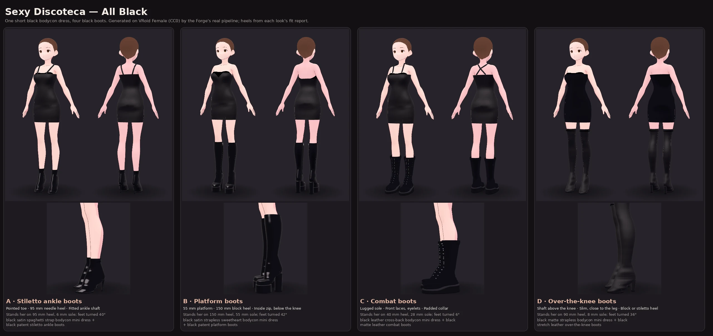

# Sexy Discoteca — All Black

A short black bodycon dress and four pairs of black boots: four different nights
out from one dress. Collection id `sexy-discoteca-black`
(`wardrobe/pipeline/fashion_collections.py`).

Regenerate the sheet with
`python tools/gallery/discoteca.py --sheet docs/images/discoteca.webp`. It builds
the four presets through the real pipeline. The heel and sole printed under each
pair come from that job's fit report.

## The pieces

| | Template | What makes it this boot |
| --- | --- | --- |
| Dress | `dress-mini-bodycon-v1` | Bodycon mini. Spaghetti straps, strapless or cross-back; a straight or sweetheart neckline; closed or open back; matte, satin, glossy or leather |
| A | `shoes-stiletto-ankle-boots-v1` | Pointed toe drawn 34 mm past her toes, a 95 mm needle heel (24×28 mm at the seat, 8 mm at the tip, leaning forward), a fitted shaft to the ankle |
| B | `shoes-platform-boots-v1` | 55 mm platform under the forefoot, 150 mm block heel, round toe, shaft below the knee, a zip up the inside |
| C | `shoes-combat-boots-v1` | 28 mm lugged wedge sole climbing to a 40 mm heel, a welt, round toe, eyelets and crossed laces up the front, padded collar, looser mid-calf shaft |
| D | `shoes-over-knee-boots-v1` | Slim shaft to a third of the way up her thigh, 2.5 mm off her leg; almond toe and a 90 mm block heel |
| D′ | `shoes-over-knee-stiletto-boots-v1` | The same shaft on a 100 mm needle heel with a pointed toe |

The boots are opt-in: a prompt has to name one ("stiletto", "platform boots",
"combat boots", "over-the-knee"). A plain "boots" or "ankle boots" still plans
the older `shoes-boots-v1`. "over-the-knee" is never split at "over" any more:
"suede over-the-knee boots" used to become "suede" and "the-knee boots".

Materials: a finish word is a finish (`patent`/`glossy` → gloss, `matte`);
`leather` is satin unless a finish word says otherwise; `suede` is a matte
fabric. Each boot's sole and heel top-lift are rubber, near black whatever the
boot's colour. The welt and zip tape are a shade lighter. Laces and the lining
are the boot's colour in shade, matte. Eyelets and the zip are silver metal
(`wardrobe/materials/boots.py`).

## Heels are a stance

A heel cannot be built round a flat foot: a needle under a flat heel stands in
the floor, and a platform under a flat foot is a box she stands inside. So a
pair with a heel or a sole first stands her on it (`wardrobe/vrm/stance.py`,
the `set_stance` stage, after the base body is prepared and before anything is
built):

- each foot is turned down about its ankle, and each toe joint turned back by
  the same angle, so her toes lie flat on the sole;
- she is lifted until the lowest visible vertex of her foot rests on the sole
  plus a 4 mm insole;
- every skinned mesh in the file — body, face, hair, earlier garments, tattoos —
  is re-skinned into that pose with its own weights. Each vertex is taken back
  through its own blend of the stance it is in, then into the new one. Every
  skin's inverse bind matrices are recomputed, so the file is bound at rest
  exactly as before. Bones, names, hierarchy and weights are unchanged; only
  the hips, feet and toes rest transforms move.

The stance is recorded on the hips node (`extras.wardrobeForgeStance`) and in
the fit report (`stance`, with the `previous` one). A later pair of shoes goes
from it to theirs in one bake. A dress put on a booted look leaves it alone,
because the boots are still on her. Flat shoes on flat feet change nothing:
every look made before this is byte-for-byte what it was.

Measured on VRoid Female: A turns her feet 40° and lifts her 58 mm; B turns
them 42° and lifts her 113 mm; C turns them 6° and lifts her 40 mm; D turns
them 36° and lifts her 61 mm.

## How a boot is built

`wardrobe/geometry/boots.py`. Her posed foot and leg are cut by horizontal
planes: every 4 mm round the foot, every 12 mm up the shaft. The cut is taken
from what is drawn. A vertex that an alpha-cut texture hides is not her foot
(`wardrobe/vrm/visible.py`): AvatarSample A's Bottoms carries a hidden sheet
round her shins that made the first boots drums. Each cut is enclosed by a ring
that is checked against every point of it and grown until all of them are
inside, then eased: 3–6 mm round the foot, 2.5–11 mm up the shaft, blended over
6 cm above the ankle.

A turned-down foot cut horizontally is a band from under the arch to over the
instep. The rings therefore follow the arch down to the ball and the vamp up to
the ankle by themselves. The hollows over her heel and across her instep are
filled, as leather stretched across them would be. The style then adds:

- **Toe:** drawn out past her toes and pointed, almond or round, in plan and in
  profile.
- **Sole:** a thin forefoot sole, a platform, or a lugged wedge with a welt.
- **Heel:** a post from the floor up into the heel seat — a needle or a block.
  Its back is flush with the heel cup, and its bottom 8 mm is a rubber top-lift.
- **Closure:** laces and eyelets, or a zip with its pull.
- **Top edge:** a padded collar, and a lining fold at the top so the edge has a
  thickness.

The heel post, sole and platform are bound to the foot bone alone
(`rigidFoot`). The rest is skinned as any garment is. A boot is marked `placed`,
so no later radial or limb pass moves part of it.

## The Studio

The designer starts with **Sexy Discoteca → All Black**:

1. **Outfit** — the four presets fill every control below.
2. **The dress** — straps, neckline, back, fabric. *Make the dress* makes it as
   a look.
3. **The boots** — four cards, A–D, with the over-the-knee pair's block or
   stiletto heel, and the boots' material chosen apart from the dress's. With a
   dress made, choosing a boot puts that pair on *the dress look*
   (`baseLookId`). Only the boots are fitted, she is re-stood on their heels,
   and the dress is carried. A pair already made on this dress is worn again,
   not remade. *Whole outfit* makes dress and boots in one job.

Every look is saved to her wardrobe and exported in the VRM pack like any
other.

## Presets and the dictionary

`discoteca_stiletto_ankle`, `discoteca_platform`, `discoteca_combat` and
`discoteca_over_knee` (`wardrobe/pipeline/look_presets.py`, from the
collection). The same four are in the outfit dictionary under
`Sexy Discoteca · All Black` (`GET /v1/outfits`). They are clothes and nothing
sheer, so they are rated general and need no declaration.

## Tests

- `tests/unit/test_stance.py`: the heel asked for is the heel she stands on;
  heel A then heel B is heel B; any heel then flat is the file she came in;
  every skin is still bound at rest.
- `tests/integration/test_discoteca.py`: each preset generates and validates on
  its heels; the four shafts and soles are four shapes; her feet stay inside
  the boots; changing boots on a dress look re-fits only the boots; a dress on a
  booted look keeps her on her heels.
- `tests/integration/test_haul_pipeline.py::test_every_template_completes_and_passes`
  runs all five boots on the calibration body.

## Limits

- The stance needs foot and toe bones. Without toe bones she stands flat in the
  boots: the sole is never above her lowest point, and no heel post is built.
- The foot is turned in the rest pose. An animation that also points her foot
  points it further.
- A boot's lining fold is 1.5–2 mm inside the top edge. Under a skin-tight
  shaft it is the edge's thickness, not a separate lining.
