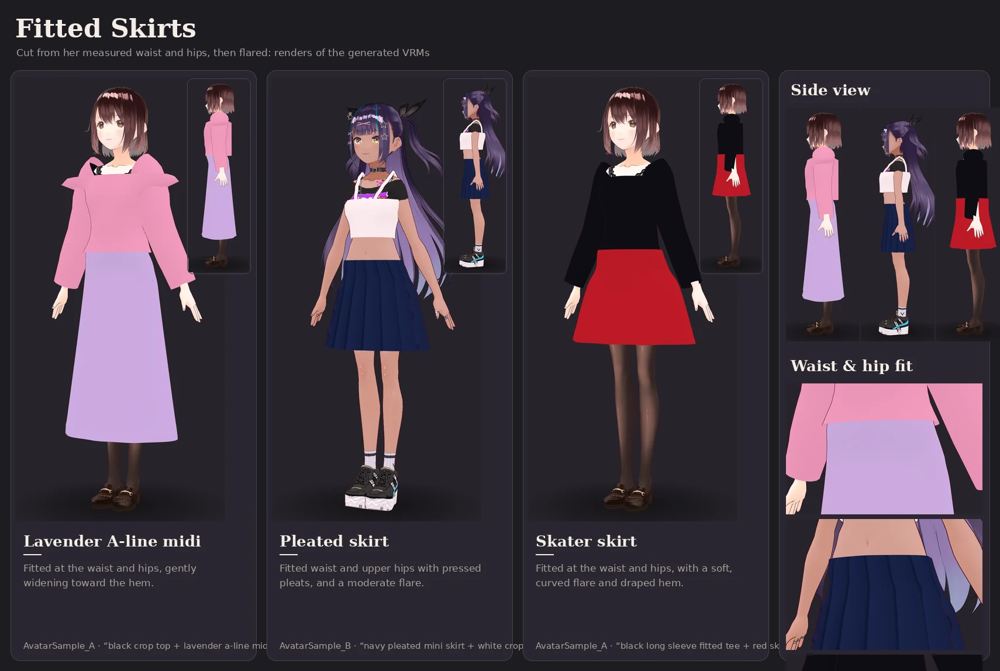

# Fit quality on real avatars

A garment is generated at the avatar's own measurements, then fitted to her
body. The calibration mannequins the acceptance suite uses are clean by
construction: no hair, legs well apart, a chest no wider than the shoulders.
Real VRoid avatars have none of those properties, and dressing the four library
avatars in fifteen everyday looks each exposed seven fit failures that no
mannequin had. This page records each one, the mechanism behind it, and what the
fitter does now. The regression tests are
[`tests/unit/test_real_avatar_fit.py`](../tests/unit/test_real_avatar_fit.py):
the synthetic cases always run, and the real-avatar cases run when
`make library` has fetched the avatars.

The pictures are in [`assets/gallery/real/`](../assets/gallery/real/README.md).
[`tools/gallery`](../tools/gallery/README.md) regenerates them with
`looks.py --avatar`.

## What was wrong, and why

| Seen on | What it looked like | Cause | Now |
| --- | --- | --- | --- |
| AvatarSample B | Crop top with wings at shoulder height; a dress flared into a bell at her hips | Her hair reaches her thighs, 33 cm out from her axis, and was read as body. Her T-pose fingertips (60 cm out) were too, because no exclusion list named finger bones | Vertices whose strongest joint is the head or anything under it are never body. Finger, toe, eye and jaw bones count as hand, foot and head |
| All four | Jeans as one boxy column | Leg radius came from hip width. On legs 14 cm apart centre to centre, two 7 cm tubes met in the middle | Legs are measured every 3 cm below the crotch, as cross-sections with their own centre. Ease depends on the cut. The two legs never cross her midline |
| All four | A ledge standing off each hip on trousers, leggings and catsuit | Every torso band stopped at a fixed fraction of the thigh, below the crotch, where the body is already two legs | The crotch is measured, as the height at which her midline stops being pelvis front to back. Bands end there and leg tubes start there |
| All four | Straps as a rectangle floating round the shoulders; a halter tie sticking out as a flap | Strap paths were formula points: 4 cm above the shoulder joint, centred on the bones rather than the body | Her upper body is measured as a depth map. Straps run up her chest, over the top of her shoulder, halfway between neck and joint, and down her back. Halter ties go round her neck |
| A, fem VRoid | Dark slivers at the sides of a bodycon dress | Her chest under the armpit is wider than her shoulder joints, so it was classed as arm and left out of clearance. The top edge also ran above her armpit | A point is arm only within 1.8× the arm's median radius of it. Sleeveless top edges stop at her measured armpit |
| A, catsuit | Body at the bust through a skin-tight garment | A flat face between two rows 3 cm apart cuts across a curve every one of its corners clears | Faces are sampled at centre and edge midpoints. A face that dips in is pushed out |
| All four | Tee sleeves as boxes; jacket sleeves as bells | Sleeve radius was 8.5% of arm length, about twice a VRoid arm | Arms are measured along the bone chain. Ease: about 1 cm (catsuit), 2 cm (tee), 3 cm (jacket) |

Smaller fixes made along the way:
- Leggings were cut inside her calves: the outlier cap assumed a leg round its bone, and the shin bone runs down the front of the leg.
- A pair of knock-kneed baggy legs was classed as torso and fitted as one bulge.
- Trouser shorts had a jagged hem, from a leg path that ran down to the knee and back up.
- The Blender worker chose the body as the largest mesh, which long hair can be.

## Measured

On AvatarSample A, counted by ray casting from the body's own axis through
every sampled body point:

| Look | Body points through the garment |
| --- | --- |
| Bodycon mini dress (rays from her axis) | 769 before the armpit fixes, 8 after |
| Catsuit at the bust (rays from her axis) | a band at y ≈ 1.16 before face settling, none after |
| Leggings (rays from each leg's own bone) | 4 of 6,789, each under 1 mm |

Rays from her body axis cannot judge legs: between the legs they pass through
the other leg first. Legs are measured from each leg's own bone.

Across the four library avatars × fifteen looks, every job completes and every
fit report passes. The stocking look reports `clearance-only`, because a garment
worn only on the legs has nothing for the torso check to measure.

## Skirts: cut from her waist and hips, then flared

A skirt used to be a cone. Every ring was her hip width times a taper, and only
the top ring was her real width, so it stepped out from her waist and ran
straight to a hem 55% (A-line) or 70% (fit-and-flare) wider than her hips.
Pleats were bumps that only ever pushed outward, and the smooth normals hid
them. `tools/gallery/skirts.py` renders the sheet above from the real pipeline.

| What it looked like | Cause | Now |
| --- | --- | --- |
| A trapezoid from the waist down | Rings scaled from one hip width, flared linearly | Her torso is measured every 1.5 cm from chest to knee (`torsoProfile`, arms excluded). Above the flare start the skirt is her outline plus ease. Below, it hangs from her full hip and widens as `progress ** flarePower` |
| The hip searched in the wrong place | Below the crotch, A-pose legs spread apart and read as hips | The full hip is searched between the crotch and the waist |
| Hems far too wide | `SILHOUETTES` flare 1.55 and 1.70 applied to the whole skirt | The hem is a ratio of her full hip, per silhouette (`SKIRT_SHAPES`), overridable per template |
| Pleats as a bell, or invisible | Outward-only offsets on a few segments, smooth-shaded | Zero-mean folds, six segments per pleat, phased by the loft's own U. Folds are clamped to body plus clearance, never inside her. On plain fabric they get a pleat-shading texture |
| A skater skirt as a stiff lampshade | No drape | A soft sinusoidal hem drape (`drapeFolds`, `hemDrape`), zero-mean, growing toward the hem |

The template fields are `hemFlareRatio`, `flareStart`
(`waist` / `high-hip` / `hip` / `below-hip`), `flarePower`, `waistEaseMm`,
`hipEaseMm`, `pleatDepth`, `drapeFolds` and `hemDrape`
([GARMENT_TEMPLATE_SPEC.md](GARMENT_TEMPLATE_SPEC.md)). A template that sets
none of them still gets its silhouette's defaults. Dress skirts use the same
builder, blended into the bodice over the top 4 cm.

That is why 48 of the 81 gallery looks have new geometry hashes: those with a
dress or skirt, plus the tops, cardigans and coats layered with one. No bra,
brief, stocking or trouser moved. The baseline in
`tests/fixtures/gallery_geometry_hashes.json` was regenerated to match.
[`tests/unit/test_skirt_fit.py`](../tests/unit/test_skirt_fit.py)
holds the silhouette to numbers:

- hem ratio per silhouette
- fitted waist
- monotonic below the hip
- progressive flare
- no skirt template over 1.9× her hip
- zero-mean pleats and drape that never enter the body

## What is still true

- **Clothes painted onto the skin stay.** VRoid often paints an inner layer onto
  the body texture: AvatarSample A's lace camisole and tights, B's printed top,
  the plain VRoid body's bandeau. Only garment meshes can be taken off, so a
  low-cut new outfit shows what is painted underneath.
- **Legs that touch make trousers that touch.** On AvatarSample B the two legs
  of a pair of jeans meet at her midline for their whole length, as real jeans
  do on legs that touch. They are two legs, but from the front the gap does not
  show.
- **Jackets and coats are boxy.** Their bodies are built with ease from the
  formula torso, and their shoulders sit high. Sleeves are measured; shoulders
  are not yet.
- **One rest pose.** Everything is fitted in the rest pose and skinned. The
  pose stress test checks that garments follow the body; the pictures show only
  the A-pose.
