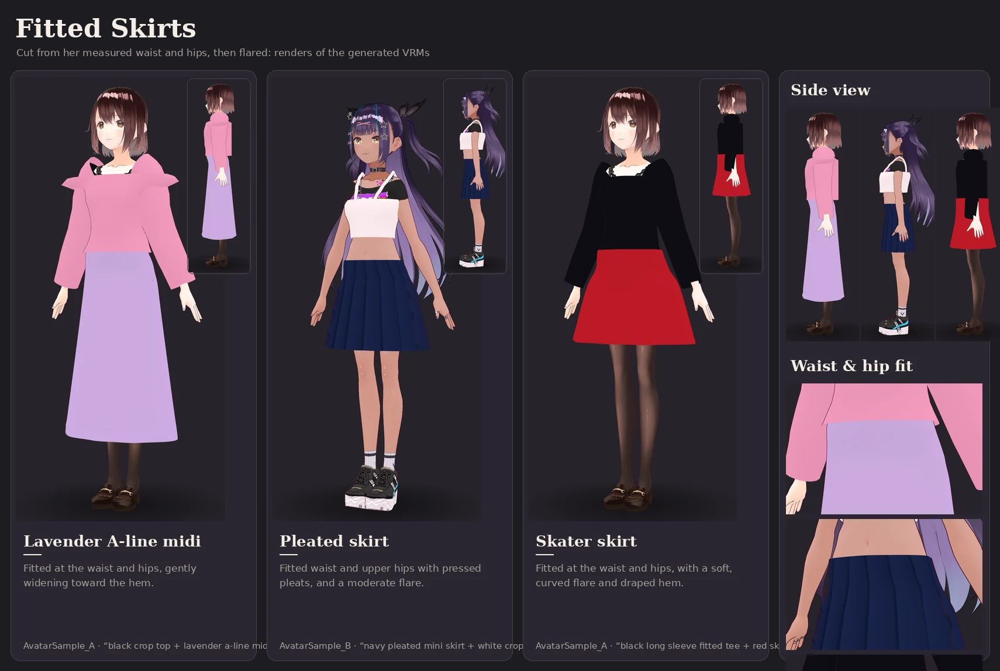
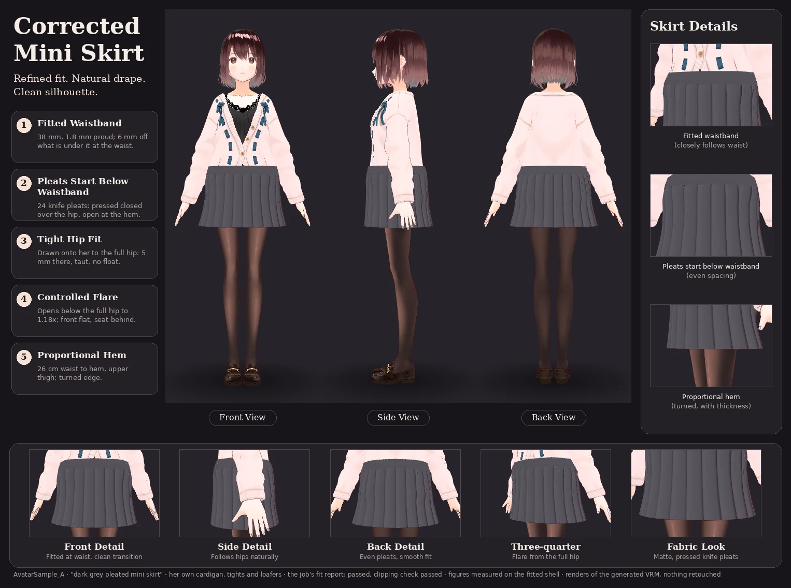

# Fit quality on real avatars

A garment is generated at the avatar's own measurements, then fitted to her
body. The calibration mannequins the acceptance suite uses are clean by
construction: no hair, legs well apart, a chest no wider than the shoulders.
Real VRoid avatars have none of those properties, and dressing the four library
avatars in fifteen everyday looks each exposed seven fit failures that no
mannequin had. This page records each one, the mechanism behind it, and what the
fitter does now. The regression tests are
[`tests/unit/test_real_avatar_fit.py`](../tests/unit/test_real_avatar_fit.py):
the synthetic cases always run, and the real-avatar cases run when
`make library` has fetched the avatars.

The pictures are in [`assets/gallery/real/`](../assets/gallery/real/README.md).
[`tools/gallery`](../tools/gallery/README.md) regenerates them with
`looks.py --avatar`.

## What was wrong, and why

| Seen on | What it looked like | Cause | Now |
| --- | --- | --- | --- |
| AvatarSample B | Crop top with wings at shoulder height; a dress flared into a bell at her hips | Her hair reaches her thighs, 33 cm out from her axis, and was read as body. Her T-pose fingertips (60 cm out) were too, because no exclusion list named finger bones | Vertices whose strongest joint is the head or anything under it are never body. Finger, toe, eye and jaw bones count as hand, foot and head |
| All four | Jeans as one boxy column | Leg radius came from hip width. On legs 14 cm apart centre to centre, two 7 cm tubes met in the middle | Legs are measured every 3 cm below the crotch, as cross-sections with their own centre. Ease depends on the cut. The two legs never cross her midline |
| All four | A ledge standing off each hip on trousers, leggings and catsuit | Every torso band stopped at a fixed fraction of the thigh, below the crotch, where the body is already two legs | The crotch is measured, as the height at which her midline stops being pelvis front to back. Bands end there and leg tubes start there |
| All four | Straps as a rectangle floating round the shoulders; a halter tie sticking out as a flap | Strap paths were formula points: 4 cm above the shoulder joint, centred on the bones rather than the body | Her upper body is measured as a depth map. Straps run up her chest, over the top of her shoulder, halfway between neck and joint, and down her back. Halter ties go round her neck |
| A, fem VRoid | Dark slivers at the sides of a bodycon dress | Her chest under the armpit is wider than her shoulder joints, so it was classed as arm and left out of clearance. The top edge also ran above her armpit | A point is arm only within 1.8× the arm's median radius of it. Sleeveless top edges stop at her measured armpit |
| A, catsuit | Body at the bust through a skin-tight garment | A flat face between two rows 3 cm apart cuts across a curve every one of its corners clears | Faces are sampled at centre and edge midpoints. A face that dips in is pushed out |
| All four | Tee sleeves as boxes; jacket sleeves as bells | Sleeve radius was 8.5% of arm length, about twice a VRoid arm | Arms are measured along the bone chain. Ease: about 1 cm (catsuit), 2 cm (tee), 3 cm (jacket) |

Smaller fixes made along the way:
- Leggings were cut inside her calves: the outlier cap assumed a leg round its bone, and the shin bone runs down the front of the leg.
- A pair of knock-kneed baggy legs was classed as torso and fitted as one bulge.
- Trouser shorts had a jagged hem, from a leg path that ran down to the knee and back up.
- The Blender worker chose the body as the largest mesh, which long hair can be.

## Measured

On AvatarSample A, counted by ray casting from the body's own axis through
every sampled body point:

| Look | Body points through the garment |
| --- | --- |
| Bodycon mini dress (rays from her axis) | 769 before the armpit fixes, 8 after |
| Catsuit at the bust (rays from her axis) | a band at y ≈ 1.16 before face settling, none after |
| Leggings (rays from each leg's own bone) | 4 of 6,789, each under 1 mm |

Rays from her body axis cannot judge legs: between the legs they pass through
the other leg first. Legs are measured from each leg's own bone.

Across the four library avatars × fifteen looks, every job completes and every
fit report passes. The stocking look reports `clearance-only`, because a garment
worn only on the legs has nothing for the torso check to measure.

## Skirts: cut from her waist and hips, then flared

A skirt used to be a cone. Every ring was her hip width times a taper, and only
the top ring was her real width, so it stepped out from her waist and ran
straight to a hem 55% (A-line) or 70% (fit-and-flare) wider than her hips.
Pleats were bumps that only ever pushed outward, and the smooth normals hid
them. `tools/gallery/skirts.py` renders the sheet above from the real pipeline.

| What it looked like | Cause | Now |
| --- | --- | --- |
| A trapezoid from the waist down | Rings scaled from one hip width, flared linearly | Her torso is measured every 1.5 cm from chest to knee (`torsoProfile`, arms excluded). Above the flare start the skirt is her outline plus ease. Below, it hangs from her full hip and widens as `progress ** flarePower` |
| The hip searched in the wrong place | Below the crotch, A-pose legs spread apart and read as hips | The full hip is searched between the crotch and the waist |
| Hems far too wide | `SILHOUETTES` flare 1.55 and 1.70 applied to the whole skirt | The hem is a ratio of her full hip, per silhouette (`SKIRT_SHAPES`), overridable per template |
| Pleats as a bell, or invisible | Outward-only offsets on a few segments, smooth-shaded | Zero-mean folds, six segments per pleat, phased by the loft's own U. Folds are clamped to body plus clearance, never inside her. On plain fabric they get a pleat-shading texture |
| A skater skirt as a stiff lampshade | No drape | A soft sinusoidal hem drape (`drapeFolds`, `hemDrape`), zero-mean, growing toward the hem |

The template fields are `hemFlareRatio`, `flareStart`
(`waist` / `high-hip` / `hip` / `below-hip`), `flarePower`, `waistEaseMm`,
`hipEaseMm`, `pleatDepth`, `drapeFolds` and `hemDrape`
([GARMENT_TEMPLATE_SPEC.md](GARMENT_TEMPLATE_SPEC.md)). A template that sets
none of them still gets its silhouette's defaults. Dress skirts use the same
builder, blended into the bodice over the top 4 cm.

That is why 48 of the 81 gallery looks have new geometry hashes: those with a
dress or skirt, plus the tops, cardigans and coats layered with one. No bra,
brief, stocking or trouser moved. The baseline in
`tests/fixtures/gallery_geometry_hashes.json` was regenerated to match.
[`tests/unit/test_skirt_fit.py`](../tests/unit/test_skirt_fit.py)
holds the silhouette to numbers:

- hem ratio per silhouette
- fitted waist
- monotonic below the hip
- progressive flare
- no skirt template over 1.9× her hip
- zero-mean pleats and drape that never enter the body

### The pleated mini, corrected (S4)

On AvatarSample A, under a cardigan, the pleated mini still read as a lampshade.
These figures are measured on its fitted shell:

| What it looked like | Cause | Now |
| --- | --- | --- |
| Flared from just under the waist to a hem 1.6× her hip | `flareStart: high-hip`, `flarePower: 1.0`, `hemFlareRatio: 1.5`: a straight cone from halfway between waist and hip | `flareStart: hip`, `flarePower: 1.35`, `hemFlareRatio: 1.22`. Fitted down to the full hip, then a late, gentle flare. The hem is 1.16× her hip width |
| A thin band, 2.5 cm on her | The band took whichever 1.5 cm row fell within 3.2 cm of the top | `waistbandMm: 38`. `build_skirt` puts a row exactly there, and another 6 mm under it where the pleats are set (`PLEAT_SET_M`) |
| Pleats wide in front and narrow at the hips | Loft columns at equal angles round an ellipse wider than it is deep | Columns are an equal length of fabric apart (`loft(..., even=True)`), so the 24 pleats are one width all round |
| Pressed edges that zig-zagged | Each fold landed on a column, and float32 UVs put it one column left on some rows and one right on others | The pleat phase is snapped before it is split (`PLEAT_SNAP`). A whole number of columns per pleat, at least 8 (`PLEAT_COLUMNS`), keeps every fold on the same column |
| A paper hem | One surface | A turned hem (`add_hem_facing`): the bottom row of faces copied 2.5 mm inside and closed at the edge |

### Real knife pleats, a flat front, a shorter mini (S5)

A review of S4 found the skirt still read as CG cloth. The pleats were extruded
wedges, the flare was the same in every direction, the band floated, and the
mini was too long. Measured on the fitted shell on AvatarSample A:

| What it looked like | Cause | Now |
| --- | --- | --- |
| Pleats like polygon wedges | `apply_pleats` moves each vertex in or out by a sawtooth and never folds the surface back on itself | `apply_knife_pleats`: each pleat's columns are spent on a fabric path, a visible face (seven or eight columns), the underfold under the next pleat and its return (two each). The fold edge is a hard crease, its vertices split between the face and the layer under it. The layers are folded all the way up to the stitching line, flat there (`KNIFE_MIN_GAP_M` apart) and opening to full depth a third of the way down. Twelve columns a pleat (`PLEAT_COLUMNS`) |
| A cone from the side | The flare grew front and back by the same amount | `frontFlare` / `backFlare` share out the front-to-back growth. The mini uses 0.45 / 1.0: hip to hem her front grows 1.4 cm and her back 2.9 cm, and the sides keep the full flare |
| A belt floating round her | Band 3 mm proud of a skirt 9 mm off the liner | A cut band stands 1.8 mm proud (`FITTED_WAISTBAND_PROUD_M`). The mini's `bodyClearanceMm` is 3 (plus the 3 mm allowance for a garment over another), so it measures 6.0–6.5 mm off the liner from waist to upper hip, with no vertex inside that |
| Too long for a mini | `hem: mini` was 0.34 of her hip-to-ankle drop: 35 cm, 10 cm above her knee | `MINI_HEM_FRACTION = 0.22`: 26 cm, upper thigh, still above the crotch-clearance floor. This applies to skirts, dresses and the skirted swimsuit (); shorts keep 0.34 |
| A hem like a drawn circle | No variation | `drapeFolds: 5`, `hemDrape: 0.012`: a soft, zero-mean wave that grows toward the turned hem |

`hemFlareRatio`Thirty-five of the 81 gallery looks have new geometry hashes: every mini skirt and
mini dress, and the tops, cardigans and coats fitted over one. Shorts, trousers and
everything else are byte-identical, and the baseline was regenerated for those 35.

 is 1.20. The hem is 1.20× her hip width, inside the 1.18–1.22
the review asked for. `tests/unit/test_real_avatar_fit.py` holds the generated
VRM to it end to end:

- the fit passes
- the band is 36–40 mm
- the skirt is 22–30 cm long
- the hem is 1.12–1.3× her hip
- every pleated row has exactly 24 creases, evenly spread round her

`test_skirt_fit.py` checks the fold itself:

- face over underfold
- the cut's size kept
- every pleat built the same
- nothing inside her
- a flat front with the seat behind
- the mini's length

### Tight over the hip, pleats closed there (S6)

The next review said the hip was still too loose. The skirt opened before it had
followed her waist, high hip and full hip, and the pleats were as open at the hip
as at the hem. On AvatarSample A, measured on the fitted shell from what lies under
it (the slip liner):

| What it looked like | Cause | Now |
| --- | --- | --- |
| Loose over the seat | Conforming stopped at the hip joint, above her full hip | `conformTo: "full-hip"`: drawn onto her down to the full hip, eased out over 3 cm (`conform_to_body(fade_m=…)`). `waistEaseMm 0`, `hipEaseMm 2`, `bodyClearanceMm 1.5` (+3 mm allowance over the liner): 5 mm at the waist, 4.5–6 mm through the hip |
| Pleats equally open top to bottom | The fold reached full depth a third of the way down | `apply_knife_pleats(opening=…)`: 0 at the stitching line, 15% at the upper hip, 30% at the full hip, 68% at mid-skirt, 100% at the hem |
| Fold lines kinking at the hip | Within millimetres of her, the clearance passes printed the avatar's hip facets through, and the hip itself bends at a corner | `taut_columns`: each column, waist to the flare, takes its upper hull (spanning hollows) and its bends rounded over 2 cm (`TAUT_ROUND_M`). Lifted locally, never lowered |
| An early flare | `flarePower 1.35` opens from the hip at once | `flarePower 1.8` from the full hip: it leaves the hip vertical and opens below it, with no corner. The hem is 1.18–1.19× her hip |

`flareStart: "below-hip"` was tried: a straight section between the full hip and
the flare made every fold bend twice. A higher power gives the same late opening
smoothly.

## What is still true

- **Clothes painted onto the skin stay.** VRoid often paints an inner layer onto
  the body texture: AvatarSample A's lace camisole and tights, B's printed top,
  the plain VRoid body's bandeau. Only garment meshes can be taken off, so a
  low-cut new outfit shows what is painted underneath.
- **Legs that touch make trousers that touch.** On AvatarSample B the two legs
  of a pair of jeans meet at her midline for their whole length, as real jeans
  do on legs that touch. They are two legs, but from the front the gap does not
  show.
- **Jackets and coats are boxy.** Their bodies are built with ease from the
  formula torso, and their shoulders sit high. Sleeves are measured; shoulders
  are not yet.
- **One rest pose.** Everything is fitted in the rest pose and skinned. The
  pose stress test checks that garments follow the body; the pictures show only
  the A-pose.
