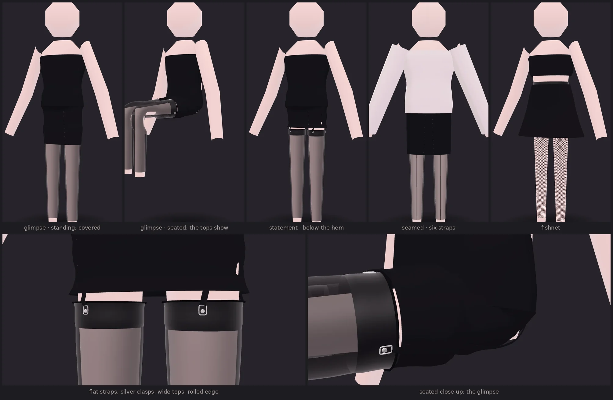

# Hosiery and suspenders

**Status: built.** Stockings, suspender belts, flat straps with clasps, the
reveal of the stocking tops under a hem, and posed previews, all inside the native
engine as one system. This is the reference for what ships. The design documents
it came from ([HOSIERY_STYLING](HOSIERY_STYLING.md),
[HOSIERY_PREVIEW](HOSIERY_PREVIEW.md), [HOSIERY_UPGRADE](HOSIERY_UPGRADE.md))
explain the reasoning, and §11 lists where the build departs from them.



_The reference look (`classic_black_mini_dress`) and its variants on the tall
calibration mannequin, which the repository declares adult. From the left: glimpse
standing, where the tops are covered; the same look seated, where they show;
statement; seamed with six straps; fishnet. Below: the statement close-up and the
seated close-up. Every picture is a render of the VRM the pipeline produced._

## 1. One fit model

```text
plan ─► gate ─► fit, inner first:
   foundation  belt / waspie / guêpière ───────────► publishes FittedBelt (lower edge, skin binding)
   legwear     stockings ───────────────────────────► publishes FittedStockingTop per leg
   connector   ribbons + hardware   ◄── reads both; never recomputes a stocking top
   main/outer  skirt or dress: hem solved for the reveal ◄── reads FittedStockingTop
─► hosiery fit-report block ─► assemble ─► validate ─► previews (stand, close-up, sit, walk, back)
```

The stockings are fitted like any legwear. Their band's rings are then read back
off the fitted, skin-bound mesh and published as a `FittedStockingTop`
(`wardrobe/hosiery/contract.py`). It holds:

- the top and bottom rings where fitting left them
- the outward normals
- the band width
- one `ClipPoint` per strap, with its world position, its surface coordinates (`u`
  turns round the leg from her front, `v` metres below the top edge), its normal and
  tangent, and the skin binding of the band there

The straps end at those points, the clasps sit on them, and the reveal solver
measures the hem against the same rings. Nothing else in the system knows where a
stocking top is.

## 2. Modules

| Module | Does |
| --- | --- |
| `options.py` | The request blocks and the resolved `HosieryPlan`; the denier map |
| `planning.py` | Adds belt, stockings, connector and reveal to a layered plan, only when asked |
| `presets.py` | Named looks, including `classic_black_mini_dress` |
| `stockings.py` | Front-framed stocking tubes; band, rolled edge and seam laid on the fitted rings; UVs; publishes the tops |
| `garter_belt.py` | Classic, high-waisted, waspie and guêpière belts; publishes the belt's edge |
| `suspender_straps.py` | Ribbon primitive, strap paths, tab choice, taut-length tension |
| `hardware.py` | Clasp, slider and O-ring: parametric, opaque, rigidly bound |
| `materials.py` | Denier alpha with side darkening, tinted veil, band, edge, seam, metal |
| `poses.py` | Standing, walking and seated poses that respect which way she faces; posing a whole VRM |
| `reveal.py` | The fabric-length reveal model and the hem solver |
| `fit.py`, `assembly.py` | The engine hooks, and which primitive gets which material |
| `report.py` | The `hosiery` block of the fit report |
| `previews.py` | Posed bakes, skirt drape, and the native, web and auto backends |

## 3. The request

Every block is optional. An outfit request without `hosiery`, `suspenderBelt`,
`reveal` or `preset`, and without a hosiery belt named in its prompt, plans exactly
as it did before (§10). Out-of-range values are refused when the request is made:
the API returns 422 with the field named. Snake case (`top_style`) and camel case
(`topStyle`) are both accepted.

A complete example:

```json
{
  "avatar": {"storageKey": "sources/mannequin.vrm", "avatarId": "calibration-c-tall", "depictsAdult": true},
  "outfit": {
    "prompt": "black bodycon mini dress",
    "hosiery": {
      "type": "sheer",
      "denier": 20,
      "color": "black",
      "topStyle": "wide",
      "topWidthCm": 5,
      "rolledEdge": true,
      "backSeam": {"enabled": false, "width": 2.5, "color": null}
    },
    "suspenderBelt": {
      "enabled": true,
      "style": "classic",
      "color": "black",
      "material": "satin",
      "strapCount": 4,
      "strapWidthMm": 9,
      "strapThicknessMm": 1.2,
      "hardware": {"color": "silver", "claspEnabled": true, "adjusterEnabled": true, "ringEnabled": false},
      "visibility": "hidden_under_skirt",
      "matchingSetId": "noir-01"
    },
    "reveal": {"level": "glimpse", "explicitHemLength": null}
  },
  "options": {"renderPreview": true, "previewBackend": "auto"}
}
```

The same look as a preset is `{"prompt": "classic_black_mini_dress", "preset":
"classic_black_mini_dress"}`. A preset fills only the blocks the request leaves
empty, and it grants nothing. Its prompt replaces the request's only when the
request's prompt is the preset's name.

| Field | Values | Notes |
| --- | --- | --- |
| `hosiery.type` | `thigh_high` `sheer` `opaque` `fishnet` `seamed` | Sets defaults. `opaque` is 80 den, `seamed` is 15 den with a seam |
| `hosiery.denier` | 5–200 | 10 → 0.30, 15 → 0.38, 20 → 0.45, 30 → 0.55, 40 → 0.68, 60 and above → opaque |
| `hosiery.transparency` | 0–0.8 | Wins over `denier` |
| `hosiery.topStyle` | `plain` 3.5 cm, `wide` 5 cm, `lace` 5 cm, `silicone` 2.5 cm | `topWidthCm` overrides the height |
| `suspenderBelt.style` | `classic` `high_waisted` `waspie` `guepiere` | Each is a new template (§8) |
| `suspenderBelt.strapCount` | 4, 6 | Six adds a side strap per leg |
| `suspenderBelt.hardware.color` | `silver` `gold` `black` | Black is lacquer, not metal |
| `suspenderBelt.visibility` | `full` `hidden_under_skirt` `straps_only` | Checked against the outfit. A note is added when nothing covers a belt that should be hidden |
| `reveal.level` | `discreet` `glimpse` `statement` | Solved (§6) |
| `reveal.explicitHemLength` | a hem word, or centimetres below the waist | Wins; the report says what it achieves |

The words *waspie*, *waist cincher*, *guêpière* and *high-waisted suspender belt* in
a prompt choose those belts. The plain words *suspender belt* and *garter belt*
still choose the unchanged Garter Set.

## 4. Straps and tension

Each strap is a flat ribbon, 9 mm × 1.2 mm by default, scaled by height / 1.6 m.
It runs from a tab on the belt, through the slider (35% of the way down), to the
top of the clasp. Its centre line is the straight line between its two ends,
lifted wherever the body, the belt or the stocking would be in its way. That lift
is read from a depth map along the strap's own outward direction, built from her
torso and legs (never her arms) and the layers already fitted.

**Tension is measured, not assumed.** A strap's length in a pose is the shortest
path between its two posed ends that stays outside her posed body. Her body is
posed with its own skin weights (`suspender_straps.taut_length`). The rest length
is the standing length plus 1.5% slack. Stretch ≤ 4% is fine, 4–10% is a warning,
and above 10% is an error. A strap shorter than rest by more than 5% is reported as
`slack`, which is not a fault.

**Where the ends go** decides the numbers. On the tall calibration mannequin:

| Attachment | Walking | Seated |
| --- | --- | --- |
| Tab straight above the clip, rear clip at the back centre | +12% | +16% |
| Tab chosen on the fitted belt edge, rear clip at 0.4 turns | +4.5% | −2% |
| **Shipped:** tab chosen, rear clip at 0.33 turns | **+2.7%** | **slack** |

A strap end moves in a pose according to how far it sits from the hip's hinge line
in side view. So the connector tries every vertex of the fitted belt's lower edge on
that leg's side and face, and keeps the one whose worst stretch over walking (each
leg forward) and sitting is lowest. The strap may lean at most 19°, and its tab
stays at least 4 cm from the other tabs. Front straps go slack when she sits, as
real ones do.

## 5. Hardware and materials

- **Hardware.** The clasp is a 12 × 16 mm U-frame with a 7 mm button. The slider
  is 11 × 7 mm. The ring is 9 mm. Each part is under 200 triangles and is built
  once in its own frame, then placed at a published point: a clip, a point on the
  strap, or a tab. Every vertex of a part has the same skin binding, so a clasp
  keeps its shape in every pose (the test tolerance is 0.1 mm). Hardware is always a
  separate, opaque primitive, so a sheer or fishnet leg never makes it see-through.
- **Stocking.** The stocking is four primitives over one skinned mesh:
  - **leg**: sheer, fishnet or opaque
  - **band**: opaque; lace over a lining for `lace`
  - **rolled edge**: a 1.8 mm tube round the band's top, in a darker shade
  - **seam**: 2.5 mm wide, down the back centre line

  The edge and the seam are laid on the fitted rings after fitting, and take the
  skin weights of the vertices under them. So the seam follows the back of the leg
  in every pose and never spirals.
- **Denier and side darkening.** The leg's UVs run round the leg in turns from her
  front, and its texture bakes `alpha(u) = base + (edge − base)·sin²(2πu)`, where
  `edge = min(base + 0.25, 0.9)`. Low-alpha areas are lifted slightly toward a
  warm tone (the tinted veil). This is a view-independent approximation, and the
  report says so.
- **Fishnet** is the same stocking and the same contract, with 30 diamonds round the
  leg: larger on the thigh than at the ankle, as knitted.

## 6. The reveal

| Level | Standing | Walking | Seated |
| --- | --- | --- | --- |
| `discreet` | covered | covered | covered |
| `glimpse` | covered | covered | the band shows |
| `statement` | the band, clasps and strap ends show | show | show |

**Why the dress is not simply posed.** A dress is bound to her hips. Posed
seated, the thighs rotate and the dress does not, so skinned geometry says the
thighs pass straight through the skirt.

**The model is fabric-length conservation** (`reveal.RevealModel`):

- For each leg, the model takes three columns (front, outer side, back). Each one
  is a taut path over the posed body from her waist to the thigh at the knee.
- A hem cut at a given height gives each column a length of fabric. In a pose, that
  fabric reaches some distance down the thigh along that column's posed path.
- A skirt is a closed tube, so its hem is one ring round each thigh. The ring sits
  where the column with the least to spare runs out: the back, over her seat, when
  she sits. A cut with ease lets each column hang more on its own. Ease is 1.0 for
  a skin-tight or pencil cut and 0.3 for an A-line.
- *Covered* means the ring is 1.5 cm past the band's bottom edge. *Clips* means it
  is 1.5 cm above the band's top.

**Solving.** Candidate hems are tried every 5 mm. The solver keeps the highest hem
that is still covered where the level needs cover, or the longest hem that still
shows the clips (`statement`). A hem word in the prompt is kept as a range, and an
explicit length wins outright. The report states which level the hem actually
achieves, and in which poses the band shows.

On the calibration mannequin, with the classic bodycon mini dress, the solver puts
the hems here:

| Level | Hem height | What happens |
| --- | --- | --- |
| discreet | 0.58 m | covered seated by 1.9 cm |
| glimpse | 0.66 m | covered walking by 2.0 cm; the band shows seated by 5.6 cm |
| statement | 0.79 m | the clips show standing |

The reveal only ever moves the outer hem. It never touches the stockings, the belt
or the underwear.

## 7. Previews

For a hosiery look, the preview stage writes these files, all optional in the
bundle. Every other look keeps the single preview it always had.

| File | View |
| --- | --- |
| `preview.webp` | Standing, 3/4 view, 1086 × 1448 |
| `thumb.webp` | 384 × 512 |
| `detail.webp` | 2:1 close-up, taken in the pose where the band shows |
| `preview-sit.webp` | Seated |
| `preview-walk.webp` | Walking, seen from the side |
| `preview-back.webp` | From the back, for seamed stockings |

A posed view is a **baked copy** of the look: every skinned mesh is skinned into
the pose. The exception is the outer skirt, which is draped instead. Below her hip
line, each half is carried by the thigh it hangs over and gathered to where the
reveal model put the hem ring. So the seated picture shows what the report states
in numbers, and the baked file is still a valid VRM.

| Backend | Renders with |
| --- | --- |
| `native` | The software rasteriser. Flat shading; the default, and always available |
| `web` | The Studio's own viewer in headless Chromium (`tools/gallery/views.mjs`), as the gallery is rendered |
| `auto` | `web` when Node, Playwright and Chromium are present, otherwise `native` |

Set the backend with `WARDROBE_PREVIEW_BACKEND` or per job with
`options.previewBackend`. A `web` request that cannot run falls back to `native`
and says so in the report.

## 8. Templates, sets and the Studio

- **Templates.** There are four new templates, all `category: underwear`:
  `under-suspender-belt-v1`, `under-suspender-belt-high-v1`, `under-waspie-v1` and
  `under-guepiere-v1`. They are opt-in: a prompt reaches one only by naming it. No
  existing template changed.
- **Sets.** `matchingSetId`, or the words *matching set*, *coordinated* or
  *completo*, give the belt, the straps and the foundation pieces a shared
  `setId`, written to each node's `wardrobeForge` extras.
- **The Studio.** Under *Hosiery & Suspenders*, one switch reveals the preset chips
  and the reveal level, with a line saying which poses show the band. Then come the
  stocking type, denier and top style, with belt, strap count, clip colour, rolled
  edge and back seam folded into *Belt, straps and hardware*. The fit report gains
  a hosiery block: the reveal summary, a per-strap tension table (FL, FR, RL, RR,
  and SL/SR for six straps) for standing, walking and seated, and the close-up and
  seated previews. The whole section is disabled, with the reason, on an avatar the
  operator has not declared adult.
- **The API.** `/v1/vocabulary` lists every value under `hosiery`, presets included.

## 9. The gate

Nothing here widens it. The belts are underwear. The connector garment requires
the adult declaration. Sheer and fishnet stockings expose the body. The existing
gate (`wardrobe.policy.intimate`) evaluates every garment, and it runs before
anything is built.

The golden previews use the calibration mannequin. That body is generated,
faceless and adult-proportioned, and `assets/calibration/policy.json` declares it
adult. The tools read that declaration and send it the way an operator's
attestation travels. With it withdrawn, the same looks are refused like any
others (`test_the_gate_still_refuses_an_undeclared_avatar`). Nothing is rendered
on the library's anime-styled avatars, whose ungated form is opaque stockings
without suspenders.

## 10. Backward compatibility

`tests/fixtures/gallery_geometry_hashes.json` was written before any of this
existed, by `tools/gallery/geometry_hashes.py`. It holds one hash per garment of
the 81 gallery looks, covering positions, normals, UVs, indices, joints, weights
and material.

```bash
python tools/gallery/geometry_hashes.py /tmp/now.json --check tests/fixtures/gallery_geometry_hashes.json
# 81/81 looks identical
```

`tests/integration/test_hosiery_compat.py` re-checks a sample on every CI run. Every
hook in the engine returns at once for a garment with no hosiery role. The new
request, plan and report fields default to empty, and the extras keys `setId` and
`hosiery` are written only when set.

## 11. Limitations, and where the build departs from the design

- **Walking and sitting are the rotations of `POSE_TESTS`.** The pelvis stays
  upright when she sits, and cloth is a length along a path, not a simulated
  surface. The ease factors are chosen by cut, not measured.
- **Side darkening is baked**, so it is correct from the front and 3/4 views the
  previews use, but not from the side.
- **Tension thresholds** apply as specified, and the shipped attachment keeps the
  mannequin within them. On a very different body the tab search may not find a
  point under 10%. In that case the report names the strap and pose as an error
  (it does not fail the job).
- **The back clip is at 0.33 turns, not the back centre** (§4). This is the
  documented deviation from HOSIERY_STYLING §4.2.
- **The planner does not lengthen a strap's tab drop and re-check.** The tab search
  replaced that step.
- **`briefsOver` is not built.** Briefs are fitted before the straps, as today.
- **Stockings bound down the whole leg.** Hosiery stockings are bound to the thighs,
  shins and feet, so they follow a bent knee. Plain thigh-highs asked for in words
  keep the thigh-only binding they always had, and with it the old limitation.
- **Posed previews are baked copies**, not animation, and the draped skirt can
  crease at her midline.
- **Hosiery runs on the native engine.** A job that asks for Blender is built
  natively, with a note.
- **Web previews need Node, Playwright and Chromium.** Without them, previews
  render natively.
- **Blocked by a model's own terms.** A model whose own terms disallow sexual
  usage (the VRM 0.x calibration body's metadata says so) is refused before
  anything is built, as before.

## 12. Commands

```bash
# the golden previews (web backend; declared adult in assets/calibration/policy.json)
python tools/gallery/hosiery.py                       # -> assets/gallery/hosiery/
# the README's showcase sheet and the feature card
python tools/gallery/showcase.py --hosiery            # -> docs/images/hosiery.webp, features.webp
# nothing else moved
python tools/gallery/geometry_hashes.py /tmp/now.json --check tests/fixtures/gallery_geometry_hashes.json
# tests
pytest tests/unit/test_hosiery.py tests/integration/test_hosiery_pipeline.py tests/integration/test_hosiery_compat.py
```

The web backend's environment: `PLAYWRIGHT_CHROMIUM` names a Chromium, and
`GALLERY_CDN_ROUTE` names a module that serves three.js where the CDN is not
reachable. Both work as they do for the gallery.
