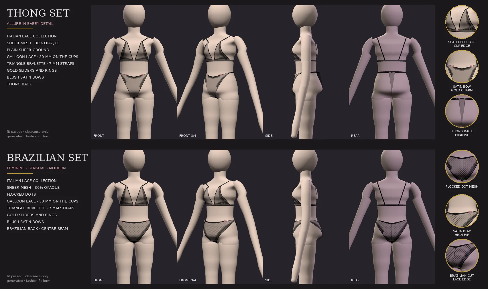

# Lingerie collections (LC1–LC5)

A collection is one coordinated lingerie product: a bra, the bottoms that belong with
it, and the finishing all of them share. The first is **Italian Lace** — a soft
triangle bralette in black sheer mesh with galloon lace, and a choice of two bottoms.



```bash
python tools/gallery/lingerie_collection.py OUT_DIR --sheet docs/images/lingerie-collection.webp
```

The sheet above is that command's output: both sets made through the real pipeline
on the fashion-fit form `assets/calibration/policy.json` declares adult, rendered by
the Studio's own viewer, captioned from the collection's design table. Nothing is
retouched.

## Asking for it

```json
{"outfit": {"prompt": "italian_lace_thong_set", "preset": "italian_lace_thong_set"}}
{"outfit": {"prompt": "…", "lingerieSet": {"collection": "italian-lace", "bottomStyle": "brazilian"}}}
```

`lingerieSet.bottomStyle` is the switch: `thong` or `brazilian`. It swaps the bottom's
pattern and detailing; the bra is the same object either way (a test compares the two
designs and holds that). The look presets `italian_lace_thong_set` and
`italian_lace_brazilian_set` are shorthand for the block, and the outfit dictionary
(`GET /v1/outfits`) offers both in its private Lingerie group.

**It grants nothing.** Both pieces are underwear: planned, rated `private` and gated
exactly as if typed. An avatar not declared adult is refused, and a test asks for it.

## What a collection decides

`wardrobe/lingerie/collections.py` is the design table. Every value is a field the
Forge already understands:

| | Bralette | Thong | Brazilian |
| --- | --- | --- | --- |
| template | `under-bralette-v2` (bra block) | `under-thong-v2` | `under-brazilian-v2` |
| cut | triangle cups, 14 mm gore, 11 mm band, 13 mm straight back band, 7 mm straps | rise 0.9, V front (0.45), string sides 5 mm, front coverage 0.30, back 0.05, 12 mm strip | rise 0.78, narrow 12 mm sides, front 0.46, back 0.44 with a V, 60 mm back centre |
| lace | 30 mm galloon down each cup's outer edge and along its lower edge, tapering to the peak | 22 mm along the front waist and the front leg edges | 28 mm scalloped along both leg openings, front and back |
| other | 4 mm binding on the cup edges, a centre bow, a gold ring at each cup peak and a slider on each strap | a blush bow at each front hip, a gold charm at centre front | a blush bow at each hip, a centre back seam, flocked dot mesh |

The pattern fields are the block grammar's (`wardrobe.lingerie.specs`), merged over the
template's own block (`collections.merge_lingerie`), so a thong here is still a thong
the fitter, the gate and the fit report understand.

## How it is made

1. **Planning** (`collections.apply`): the bra and the brief the prompt planned become
   the collection's pieces — template, name, the sheer mesh material, `setId`, and the
   piece's part of the design on `style.collection`.
2. **Drafting**: the blocks are drafted from the merged fields, as any lingerie.
3. **Finishing** (`wardrobe/lingerie/atelier.py`), after the shell and the lingerie
   seating, from the *fitted* garment:
   - a **lace band** is laid across the fabric from an edge inward, each row put onto
     the fitted triangles (closest point, not a tangent plane) and lifted 0.7 mm. It is
     never wider than 45 % of the way to the panel's nearest other edge: a thong's
     front narrows to centimetres at the gusset, a Brazilian's side to 12 mm, and a
     band of constant width there stood off her as a flap;
   - **binding** and the Brazilian's **seam** are ribbons on the edge's fitted vertices;
   - **bows**, the **charm** and the **rings and sliders** are rigid parts placed where
     the fitted garment says: the gore's top, the front-hip corner (found by walking
     out from centre front until the panel narrows to its side), a point along each
     strap's fitted path. The hardware is the hosiery kit's (`wardrobe.hosiery.hardware`).
4. **Components**: every triangle is tagged with a named component and the material it
   is made of. The specification's names: `bra_left_cup`, `bra_right_cup`,
   `bra_underband`, `bra_back_band`, `bra_strap_L/R`, `bra_lace_L/R`,
   `bra_binding_L/R`, `hardware`, `bow_center`; `bottom_front`, `bottom_back` (or
   `thong_back_strap`), `bottom_side_L/R`, `bottom_gusset`, `bottom_lace`, `bow_L/R`,
   `charm`, `bottom_back_seam`. Left and right are hers, from `forward`.
5. **Assembly** (`wardrobe/lingerie/assembly.py`): one primitive per material over the
   garment's shared, skinned vertices; the node's extras list the components
   (`wardrobeForge.components`, with each one's materials and triangle count) and the
   collection (`wardrobeForge.collection`).

**Why one node per piece and not one per component.** Every garment the Forge makes is
one skinned node: garment inventory, layering, replacement on the next look and the
adult gate all read nodes as garments. A bra of seventeen nodes would be seventeen
garments to all of them. The components are named in the node's extras instead, with
their materials, so a tool can still find `bra_strap_L`.

## Materials

Generated, like every texture in the Forge (`wardrobe/lingerie/fabrics.py`):

| material | what | how |
| --- | --- | --- |
| mesh | the panels | black, 30 % opaque, blended; the Brazilian's is flocked with 3 mm dots (`dotted_mesh`), projected from front and back so they stay round |
| lace | galloon appliqué | a band tile drawn in millimetres: a straight corded edge, five-petal flowers with veins, leaves, eyelets, a 1.6 mm net, scallops with a cord; blended |
| band | the underband and back band | the mesh's black, ~70 % opaque |
| elastic | binding, straps, strings, the seam | matte black, opaque |
| lining | the gusset | opaque |
| satin | bows | blush `#d8a1aa`, satin finish |
| metal | rings, sliders, charm | the hardware kit's gold |

Lace and mesh blend (OD2): cut out at an alpha cutoff, a fine net vanishes once a body
seen whole shrinks the texture.

## Tests

`tests/integration/test_lingerie_collection.py` builds both sets once on the fit form
and checks: the presets plan the two pieces; the switch changes only the bottom;
nothing changes without the block; lace and mesh are different fabrics; both sets are
made and fit; every named component is there (and `thong_back_strap` only on the
thong); left and right are made alike; each fabric is its own material; the lace lies
within 4 mm of the fabric's triangles (95th percentile); and an avatar not declared
adult is refused.

## Limits

- The thong's back triangle bridges the cleft of her seat, a few millimetres off it,
  as every thong the brief block makes does (`lingerie.fit._hug_back`): drawn in
  tighter it went inside her.
- Lace is a texture on a lifted band, not modelled cord. Up close it reads as lace;
  it has no relief.
- One collection so far. A second is a new entry in `COLLECTIONS` and two look
  presets; nothing else needs to change.
