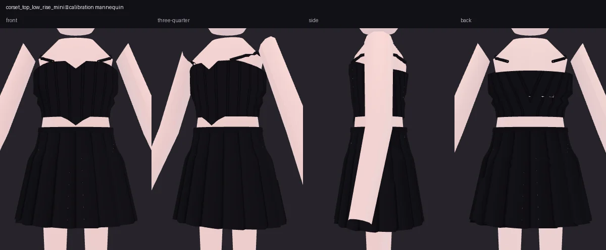
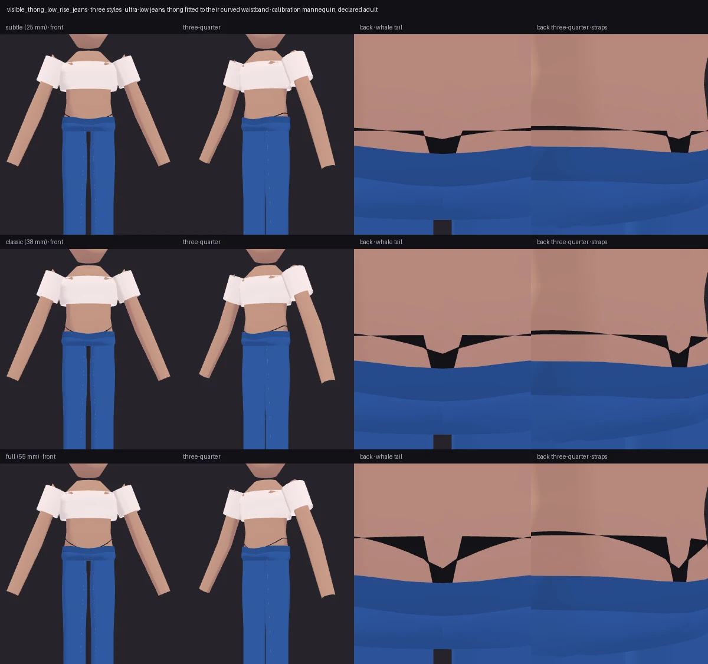
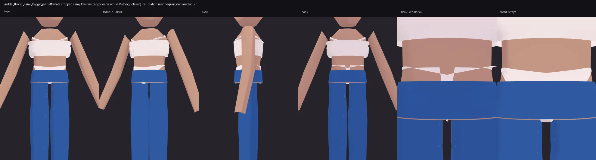

# Look presets (P1)

Named looks of more than one garment, in `wardrobe/pipeline/look_presets.py`.
Like the hosiery presets, a look preset is shorthand for a request someone could
type: it fills the prompt when the prompt *is* the preset's name, fills a block
the request left empty, and grants nothing. Every garment is planned, fitted and
gated exactly as if typed.

```json
{"outfit": {"prompt": "corset_top_low_rise_mini", "preset": "corset_top_low_rise_mini"}}
{"outfit": {"prompt": "visible_thong_low_rise_jeans", "preset": "visible_thong_low_rise_jeans",
            "visibleThong": {"style": "classic"}}}
```

`GET /v1/vocabulary` lists them under `lookPresets`.

## `corset_top_low_rise_mini` — lingerie-as-outerwear, no declaration needed

A black **corset top** (`top-corset-v1`, new) over a black **low-rise pleated
mini**. Both are clothes, so any avatar can wear it.

- **Corset** (`procedural:corset`): fitted from the bust to her natural waist —
  the crop top it borrows from stopped at the underbust — with a sweetheart
  neckline, a hem dropping 3.5 cm (at 1.6 m) to a point at centre front, shoulder
  straps, and boning channels drawn as a shaded texture every 4.5 cm, the route
  knife pleats use. "corset", "corset top", "bustier" name it; the lingerie
  foundations keep their own words (guêpière, waspie), and a lace or sheer corset
  is still gated by its material.
- **Low-rise skirt**: `rise` ("low-rise", "ultra-low") now moves a skirt's top
  too, 35% / 50% of the way from her waist to her hips. A skirt without the word
  starts at her waist exactly as before.
- **Liner**: under a low-rise skirt the slip-shorts liner is cut lower still,
  so its band never shows above the skirt's.



## `visible_thong_low_rise_jeans` — the Y2K "whale tail", underwear, gated

A white fitted crop top, blue **ultra-low-rise** straight jeans and a **tailored
V-string** whose side straps and back Y show above the jeans' waistband. It is
two garments fitted *to each other*, not two garments placed and hoped to meet
(P2):

- **The jeans come first.** An ultra-low waistband sits on her hip bones and its
  top edge follows her pelvis — 18 mm lower at centre front, 9 mm at centre
  back, highest over her hips (`trouser_top_dip`). The waistband is denim's
  narrow band, 40 mm deep all the way round and following that curve, not the
  whole yoke drawn as a belt. The yoke carries on 3 cm past her crotch over the
  tops of the legs, so nothing under the jeans shows through between them.
- **The thong is drafted against that edge.** `whale_tail_targets` reads the
  jeans' top edge from the same functions the jeans are built with, on the same
  body, and places the brief's waistline against it: the front panel 20 mm
  *under* the centre-front waistband, the straps rising to their height above
  the jeans at her high hip, the back's Y junction 18 mm above the centre back.
- **Above the jeans only a strap shows.** Every column of the brief that rises
  above the waistband is cut to a 5 mm strap; below it the brief is the brief it
  always was. There is no second "visible strap" mesh — what shows is the
  thong's own fabric, above the jeans.
- **The back is a Y, not a band.** The back straps leave the junction steeply
  and level off toward her hips (`TAIL_BACK_EASE`); a straight line climbed a
  few degrees and read as a flat band with a notch in it.

| `style` | side straps above the waistband | jeans |
| --- | --- | --- |
| `subtle` | 25 mm | ultra-low |
| `classic` | 38 mm | ultra-low |
| `full` | 55 mm | ultra-low |

`strapAboveMm` (10–90) sets the strap height directly and wins over the style;
`jeansRise` (`low` / `ultra-low`) the jeans. An explicit `thongRise` (0.2–1.15, a
fraction of her crotch → waist span) still gives P1's level waistline, for anyone
who wants it.

**It is underwear.** An avatar without an adult declaration is refused, with
Forge's usual reason, exactly as for any underwear; no preset, block or style
changes that. The pictures below use the calibration mannequin, which
`assets/calibration/policy.json` declares adult, its skin tinted a warmer tone
only so white fabric reads against it; the body and its declaration are
unchanged.



### `visible_thong_cami_baggy_jeans`

The same whale tail with a plain white **cropped cami** on thin straps
(`top-cropped-cami-v1`, new, opt-in — chosen only when named, so "crop cami"
still plans the lace one), **ultra-low baggy jeans** and a **white** tailored
V-string, `classic` by default. Gated the same way.



## What changed underneath, and what did not

- `StylePlan.whale_tail` fits a pattern-block brief's waistline to the jeans over
  it; `StylePlan.brief_rise` places it level. Only the `visibleThong` block sets
  either; every other brief is drafted as its template says.
- Trousers gain `ultra-low`; a yoke never drops within 6 cm of her crotch. Low
  and ultra-low jeans get the curved top edge and the narrow waistband; every
  other rise keeps its level top.
- **Every pair of trousers and shorts changed (P2), deliberately.** The yoke used
  to end exactly at her crotch, leaving an open slot across her front: a dark
  notch between the legs on every avatar, and on the whale tail the thong's
  gusset showing through it. The yoke now runs 3 cm on over the tops of the legs.
  Against the gallery hash baseline the 14 looks with trousers or shorts moved
  and were re-baselined after a before/after render on AvatarSample A; the other
  67 are byte-identical. The skirt liner is hidden under its skirt and keeps its
  yoke.
